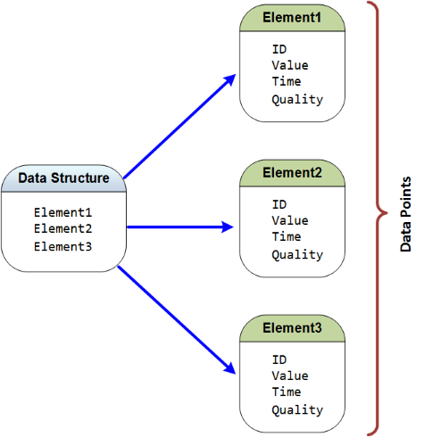
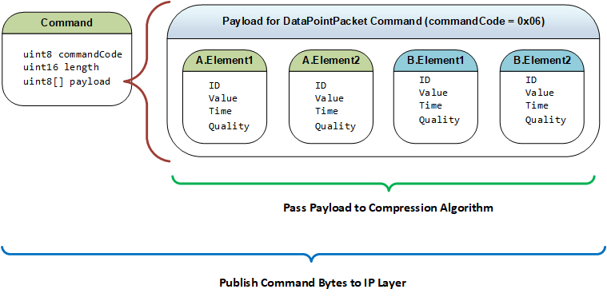

<a name="title-page"></a>


**Version:** 0.1.46 - September 28, 2017

**Status:** Initial Development

**Abstract:** This specification defines a [publish-subscribe](https://en.wikipedia.org/wiki/Publish%E2%80%93subscribe_pattern) data transfer protocol that has been optimized for exchanging streaming [time series](https://en.wikipedia.org/wiki/Time_series) style data, such as [synchrophasor](https://en.wikipedia.org/wiki/Phasor_measurement_unit) data that is used in the electric power industry, over [Internet Protocol](https://en.wikipedia.org/wiki/Internet_Protocol) (IP). The protocol supports transferring both real-time and historical time series data at full or down-sampled resolutions. Protocol benefits are realized at scale when multiplexing very large numbers of time series [data points](https://en.wikipedia.org/wiki/Data_point) at high speed, such as, hundreds of times per second per data point.

<br/>
Copyright &copy; 2017, Grid Protection Alliance, Inc., All rights reserved.

***

#### Disclaimer

This document was prepared as a part of work sponsored by an agency of the United States Government (DE-OE-0000859).  Neither the United States Government nor any agency thereof, nor any of their employees, makes any warranty, express or implied, or assumes any legal liability or responsibility for the accuracy, completeness, or usefulness of any information, apparatus, product, or process disclosed, or represents that its use would not infringe privately owned rights.  Reference herein to any specific commercial product, process, or service by trade name, trademark, manufacturer, or otherwise does not necessarily constitute or imply its endorsement, recommendation, or favoring by the United States Government or any agency thereof.  The views and opinions of authors expressed herein do not necessarily state or reflect those of the United States Government or any agency thereof.

#### License

This specification is free software and it can be redistributed and/or modified under the terms of the MIT License <sup>[[2](#user-content-ref2)]</sup>. This specification is distributed in the hope that it will be useful, but WITHOUT ANY WARRANTY; without even the implied warranty of MERCHANTABILITY or FITNESS FOR A PARTICULAR PURPOSE.

## Table of Contents

| Section | Title |
|:-------:|---------|
|   | [Title Page](#user-content-title-page) |
|   | [Preface](#disclaimer) |
| 1 | [Introduction](#introduction) |
| 2 | [Business Case](#business-case) |
| 3 | [Definitions and Nomenclature](#definitions-and-nomenclature) |
| 4 | [Protocol Overview](#protocol-overview) |
| 5 | [Establishing Connections](#establishing-connections) |
| 6 | [Commands and Responses](#commands-and-responses) |
| 7 | [Data Point Structure](#data-point-structure) |
| 8 | [Data Point Characteristics](#data-point-characteristics) |
| 9 | [Metadata](#metadata) |
| 10 | [Compression](#compression) |
| 11 | [Security](#security) |
| 12 | [References and Notes](#references-and-notes) |
| 13 | [Contributors and Reviewers](#contributors) |
| 14 | [Revision History](#major-version-history) |
| A | [Appendix A - Functional Requirements](#appendix-a---functional-requirements) |
| B | [Appendix B - STTP API Reference](#appendix-b---sttp-api-reference) |
| C | [Appendix C - IEEE C37.118 Mapping](#appendix-c---ieee-c37118-mapping) |
| D | [Appendix D - Other Protocol Evaluations](#appendix-d---other-protocol-evaluations) |
| E | [Appendix E - TSSC Algorithm](#appendix-e---tssc-algorithm) |

## Introduction

Use of synchrophasors by U.S. utilities continues to grow following the jump start provided by the Smart Grid Investment Grants (2010-2014). Several utilities now have PMU installation counts of 500 phasor measurement units (PMUs) or more and other utilities anticipate being at this level within the next few years. The dominant method to exchange synchrophasor data remains the IEEE C37.118 <sup>[[1](#user-content-ref1)]</sup> protocol that was designed for and continues to be the preferred solution for substation-to-control room communications.  It achieves its advantages through use of an ordered set (a frame) of information that is associated with a specific measurement time.  When IEEE C37.118 is used for PDC-to-PDC communication or for PDC-to-Application communication, large data frames are typically distributed to multiple systems.

To address the challenges presented by these large IEEE C37.118 frame sizes, many utilities have implemented purpose-built networks for synchrophasor data only.  Even with these purpose-built networks, large frame sizes result in an increased probability of UDP frame loss, or in the case of TCP, increased communication latency.  In addition, IEEE C37.118 has only prescriptive methods for the management of measurement metadata which is well-suited for substation-to-control-center use but which becomes difficult to manage as this metadata spans analytic solutions and is used by multiple configuration owners in a wide-area context.

The Advanced Synchrophasor Protocol (ASP) Project was proposed to DOE in response to FOA-1492. In this proposal, the argument was made for a new protocol that overcomes the limitations of IEEE C37.118 for large-scale synchrophasor data system deployments.  The new publish-subscribe protocol to be developed under the ASP Project is called the Streaming Telemetry Transport Protocol (STTP).  STTP leverages the successful design elements of the secure Gateway Exchange Protocol (GEP) that was originally developed by the Grid Protection Alliance (GPA) as part of the SIEGate project (DE-OE-536).

On May 1, 2017, a DOE grant (DE-OE-859) was awarded to GPA and the other 25 collaborators on the ASP Project (see [Contributors](#contributors) section) to: (1) write a detailed definition of the STTP protocol _(i.e., this document)_; (2) develop software to support it including production-grade implementations of STTP API's for multiple development platforms along with a collection of tools to test and validate STTP; and (3) demonstrate and evaluate its efficacy with multiple vendors and utilities.

### Scope of this Document

The purpose of this document is to define STTP and to include, as appendices, descriptions as to how to use its supporting software tools.  This STTP specification is focused on effective "streaming data" delivery of which synchrophasor data is a very important use case.

In the [Protocol Overview](#protocol-overview) section of this specification, high-level features and the business value of STTP are presented. The balance of the sections of the specification provide the details of protocol design.

[Appendix A - Functional Requirements](#appendix-a---functional-requirements) provides the set of functional requirements and use cases needed for successful STTP deployment.

[Appendix B - STTP API Reference](#appendix-b---sttp-api-reference) provides instructions to enable software developers to integrate and use of STTP within other software systems.

[Appendix C - IEEE C37.118 Mapping](#appendix-c---ieee-c37118-mapping) provides a detailed look at the process of transforming IEEE C37.118 into STTP as well as creating IEEE C37.118 streams from STTP.

[Appendix D - Other Protocol Evaluations](#appendix-d---other-protocol-evaluations) provides insight into other protocols that were considered for suitability when developing the STTP use cases and functional requirements.

[Appendix E - TSSC Algorithm](#appendix-e---tssc-algorithm) provides specification details for the Time-series Special Compression Algorithm (TSSC) which is used by STTP to archive very high compression ratios for streaming data.

While the format and structure of this document, established to facilitate collaboration, is different than that used by standards bodies, it is hoped that the content within this document can meet all the information requirements needed to enable repackaging of this specification into draft standard formats.

## Business case

At the conclusion of the ASP project in April 2019, it is anticipated that STTP will be a well-tested, thoroughly vetted, production-grade protocol that will be supported by ASP project team vendors.  An open source tool suite for STTP will be developed as part of the project (see [Appendix B](#appendix-b---sttp-api-reference)) that will include a test harness that will allow utilities and vendors outside the project to test and validate STTP in their systems and API's.

STTP offers both short-term cost savings and strategic value in that it is:

#### Intrinsically Robust

By design, STTP packet sizes are small and are optimized for network MTU size reducing fragmentation which results in more efficient TCP performance and less overall data loss with UDP.  STTP also puts significantly less stress on network routing equipment and facilitates mixing of streaming data traffic and other general network communications.  With STTP, purpose built networks are not required to reliably support very large phasor data streams.

#### Security Centric

STTP has been built using a "security first" design approach.  Authentication to establish a connection with other parties requires a certificate.  While public certificate providers can be used, it is recommended that symmetric certificates be exchanged out-of-band to avoid the risk and cost of management of public keys. Best-practice encryption is natively available in STTP but not required given the common practice to manage encryption at the network layer.

#### Reduces First Cost

A protocol similar to STTP called GEP has been measured <sup>[[5](#user-content-ref5)]</sup> to have less than half the band width requirements of IEEE C37.118 <sup>[[1](#user-content-ref1)]</sup> when used with TCP and simple methods for lossless compression.  With the compression, a single signal or measurement point (i.e., an identifier, timestamp, value and quality code) requires only 2.5 bytes. By comparison, IEEE C37.118 requires 4.5 bytes per measurement on average. The signal-based GEP protocol incorporates Pub/Sub data exchange methods so that unnecessary data points need not be exchanged - thereby further reducing overall bandwidth requirements as compared to IEEE C37.118.

#### Reduces Operating Cost

STTP will automatically exchange and synchronize measurement level meta-data using a GUID as the key value to allow the self-initialization and integration of rich meta-data with points from multiple connected synchrophasor networks.  This eliminates the need to map measurements to a pre-defined set identifiers and dispenses with the cost and hassles of synchronization of individual utility configuration with a centralized registry. Permissions for data subscriptions can be grouped and filtered using expressions to assure that only the signals that are authorized are shared (for example, all phasors from a specified substation) while the set of points available is dynamically adjusted as PMUs come and go without the need for point-by-point administrator approval.

#### An Enabling Technology

STTP provides an alternative to the existing method for utility data exchange that will enable future generations of SCADA/EMS systems to both (1) utilize full-resolution synchrophasor data streams and (2) significantly reduce the cost of maintaining the configuration of components to exchange other real-time data.  An ISO/RTO will typically exchange hundreds of thousands of data points every few seconds with its members and neighbors.  

> :information_source: ICCP (IEC 60870-6/TASE.2) is the international standard used to exchange "real-time" SCADA data among electric utilities.  Analog measurement data is typically exchanged continuously every 2 to 10 seconds with bi-modal data such as breaker status information only being exchanged "on change".  ICCP came into coordinated use in North America in the mid-1990s.

Promising technologies are being developed for cloud computing and these technologies are moving toward native implementations at individual utilities and ISOs.  These cloud computing technologies can also be leveraged to support larger native implementations such as those for an interconnect.  The common theme among these technologies is the ability to process significantly more data quickly with improved reliability.

It's possible that a protocol like STTP which allows secure, low-latency, high-volume data exchange among utilities at low cost can be a major factor in driving change toward these new technologies. New higher-speed forms of inter-utility interaction will be possible, and new approaches for providing utility information services will be realizable.  


#### Built Upon A Proven Approach

 STTP will enhance the successful design elements of the Gateway Exchange Protocol (GEP) as a foundation and improve upon it. GEP is currently in production use by Dominion, Entergy, MISO, PeakRC, TVA, FP&L, Southern Company, among others.

## Definitions and Nomenclature

The words "must", "must not", "required", "shall", "shall not", "should", "should not", "recommended", "may", and "optional" in this document are to be interpreted as described in RFC 2119 <sup>[[3](#user-content-ref3)]</sup>.

### Definition of Key Terms

>:information_source: All the terms below are hyperlinked to a key source for the definition or to a reference where more information is available.

| Term | Definition |
|-----:|:-----------|
| [**binary coded decimal**](https://en.wikipedia.org/wiki/Binary-coded_decimal) | A binary encoding scheme for decimal numbers that represents each digit with fixed number of bits.  |
| [**certificate**](https://en.wikipedia.org/wiki/X.509#Certificates) | A file that contains a public key and identity information, e.g., an organization name, hostnames, IP addresses, etc. The X.509 standard defines a standard format for certificate files that can either be self-signed or signed by a certificate authority. Certificates are used in conjunction with public-key infrastructure to provide identity validation and encryption keys used to secure IP transport protocol communications, such as with the TLS protocol. <br/> Also called _X.509 Certificate_. |
| **command channel** | STTP functionality, usually implemented using a reliable communications protocol, that is used to exchange command messages in a publisher/subscriber connection. |
| **data channel** | STTP functionality, implemented using either a reliable or lossy communications protocol, that is used to send data messages in a publisher/subscriber connection. |
| [**data point**](https://en.wikipedia.org/wiki/Data_point) | A measurement of identified data along with any associated state, e.g., time of measurement and quality of measured data. |
| [**data structure**](https://en.wikipedia.org/wiki/Data_structure) | An organized set of primitive data types where each element has a meaningful name. |
| **frame** | A data-structure composed of primitive data types that has been serialized into a discrete binary package. |
| [**endianess**](https://en.wikipedia.org/wiki/Endianness) | The hardware prescribed ordinal direction of the bits used to represent a numerical value in computer memory; usually noted as either _big-endian_ or _little-endian_. |
| [**endpoint**](https://en.wikipedia.org/wiki/Communication_endpoint) | A combination of an IP address (or hostname) and port number that represents a unique identification for establishing communications on an IP network. Endpoints, along with an IP transport protocol, are used by a socket to establish inter-device network communications. <br/> Also called _network endpoint_. |
| [**Ethernet**](https://en.wikipedia.org/wiki/Ethernet) | Frame based data transmission technology used in local area networks. |
| [**encryption key**](https://en.wikipedia.org/wiki/Key_%28cryptography%29) | A set of numbers that are used by an encryption algorithm to transform data into form that cannot be easily interpreted without knowing the key.  |
| [**firewall**](https://en.wikipedia.org/wiki/Firewall_%28computing%29) | A security system used on a computer network, existing as software on an operating system or a standalone hardware appliance, used to control the ingress and egress of network communication paths , i.e., access to endpoints, based on a configured set of rules. Security zones between networks are established using firewalls to limit accessible resources between _secure_ internal networks and _untrusted_ external networks, like the Internet. |
| [**fragmentation**](https://en.wikipedia.org/wiki/IP_fragmentation) | A process in computer networking that breaks frames into smaller fragments, called packets, that can pass over a network according to an MTU size limit. Fragments are reassembled by the receiver. <br/> Also called _network fragmentation_ |
| [**gateway**](https://en.wikipedia.org/wiki/Gateway_%28telecommunications%29) | A network system used to handle multi-protocol data exchange on the edge of a network boundary. For this specification, an edge system that uses STTP to bidirectionally exchange data with another system that uses STTP. |
| [**hostname**](https://en.wikipedia.org/wiki/Hostname) | A human readable label used in a computer network that maps to an IP address. A hostname can be used instead of an IP address to establish a socket connection for inter-device network communications. Resolution of a hostname to its IP address is handled by a DNS service which is defined as part of a system's IP configuration. |
| [**initialization vector**](https://en.wikipedia.org/wiki/Initialization_vector) | A set of random numbers used to initialize an encryption algorithm to reduce recognizable patterns in encrypted data. |
| [**IP address**](https://en.wikipedia.org/wiki/IP_address) | An unsigned integer, either 32-bits for version 4 addresses or 128-bits for version 6 address, used to uniquely identify all devices connected to a computer network using Internet Protocol. The address combined with a port number creates a unique endpoint that is used by a socket to establish a communications channel on a host system. |
| [**IP transport protocol**](https://en.wikipedia.org/wiki/Transport_layer) | An established set of governing principals that define the rules and behaviors for the transmission of data between two entities when using Internet Protocol. The most commonly used IP transport protocols are TCP and UDP. |
| **measurement** |  |
| [**packet**](https://en.wikipedia.org/wiki/Network_packet) | A block of data carried by a network whose size is dictated by the MTU. <br/> Also called _network packet_. |
| [**phasor**](https://en.wikipedia.org/wiki/Phasor) | A complex equivalent of a simple cosine wave quantity such that the complex modulus is the cosine wave amplitude and the complex angle (in polar form) is the cosine wave phase angle. |
| [**port**](https://en.wikipedia.org/wiki/Port_%28computer_networking%29) | A 16-bit unsigned integer that, along with an IP address, represents a unique endpoint for establishing communications on an IP network. A port and associated IP address, i.e., an endpoint, and a IP transport protocol is used by a socket to establish a unique communications channel. <br/> Also called _network port_. |
| [**primitive type**](https://en.wikipedia.org/wiki/Primitive_data_type) | A specific type of data provided by a programming language referenced by a keyword that represents the most basic unit of data storage - examples can include integer, float and boolean values. <br/> Also called _primitive data type_. |
| [**publish/subscribe**](https://en.wikipedia.org/wiki/Publish%E2%80%93subscribe_pattern) | A messaging pattern where senders of messages, called publishers, do not program the messages to be sent directly to specific receivers, called subscribers, but instead characterize published messages into classes without knowledge of which subscribers, if any, there may be. |
| **publisher** | STTP functionality that is used by a data provider to provision data to be sent to consumers, i.e., subscribers.  |
| [**null**](https://en.wikipedia.org/wiki/Null_pointer) | A value reserved for indicating that a reference, e.g., a pointer, is not initialized and does not refer to a valid object. |
| [**serialization**](https://en.wikipedia.org/wiki/Serialization) | Process of transforming data structures into a format that is suitable for storage or transmission over a network. |
| **signal** | |
| [**socket**](https://en.wikipedia.org/wiki/Network_socket) | A network communications mechanism, created as a programming language construct, used for sending and/or receiving data at a single destination within an IP network that is established with an endpoint and selected IP transport protocol. <br/> Also called _network socket_. |
| **subscriber** | STTP functionality that is used by a data consumer to provision data to be received from providers, i.e., publishers. |
| [**synchrophasor**](https://en.wikipedia.org/wiki/Phasor_measurement_unit) | A phasor calculated from data samples using a standard time signal as the reference for the measurement. Synchronized phasors from remote sites have a defined common phase relationship. |
| [**switch**](https://en.wikipedia.org/wiki/Network_switch) | A network system, usually existing as a physical hardware, that routes network packets directly to the intended targets. <br/> Also called _network switch_. |
| [**time series**](https://en.wikipedia.org/wiki/Time_series) | A series of data points indexed in time order, most commonly measured as a sequence taken at successive equally spaced points in time. |

### Acronyms

| Term | Definition |
|-----:|:-----------|
| **AES** | [Advanced Encryption Standard](https://en.wikipedia.org/wiki/Advanced_Encryption_Standard) |
| **API** | [Application Program Interface](https://en.wikipedia.org/wiki/Application_programming_interface) |
| **BES** | [Bulk Electric System](http://www.nerc.com/pa/RAPA/Pages/BES.aspx) |
| **CA** | [Certificate Authority](https://en.wikipedia.org/wiki/Certificate_authority) |
| **DOE** | [United States Department of Energy](https://en.wikipedia.org/wiki/United_States_Department_of_Energy) |
| **DDS** | [Data Distribution Service](https://en.wikipedia.org/wiki/Data_Distribution_Service) |
| **DNS** | [Domain Name System](https://en.wikipedia.org/wiki/Domain_Name_System) |
| **DTLS** | [Datagram Transport Layer Security](https://en.wikipedia.org/wiki/Datagram_Transport_Layer_Security) |
| **GEP** | [Gateway Exchange Protocol](http://gridprotectionalliance.org/docs/products/gsf/gep-overview.pdf) |
| **GPA** | [Grid Protection Alliance, Inc.](https://www.gridprotectionalliance.org/) |
| **GPS** | [Global Positioning System](https://en.wikipedia.org/wiki/Global_Positioning_System) |
| **GUID** | [Globally Unique Identifer](https://en.wikipedia.org/wiki/Universally_unique_identifier) |
| **ICCP** | [Inter-Control Center Communications Protocol](https://en.wikipedia.org/wiki/IEC_60870-6) |
| **IP** | [Internet Protocol](https://en.wikipedia.org/wiki/Internet_Protocol) |
| **IRIG** | [Inter-range Instrumentation Group Time Codes](https://en.wikipedia.org/wiki/IRIG_timecode) |
| **ISO** | [Independent System Operator](https://en.wikipedia.org/wiki/Regional_transmission_organization_%28North_America%29) |
| **MTU** | [Maximum Transmission Unit](https://en.wikipedia.org/wiki/Maximum_transmission_unit) |
| **NaN** | [Not a Number](https://en.wikipedia.org/wiki/NaN) |
| **NAT** | [Network Address Translation](https://en.wikipedia.org/wiki/Network_address_translation) |
| **PDC** | [Phasor Data Concentrator](http://en.openei.org/wiki/Definition:Phasor_Data_Concentrator_%28PDC%29) |
| **PMU** | [Phasor Measurement Unit](https://en.wikipedia.org/wiki/Phasor_measurement_unit) |
| **PKI** | [Public Key Infrastructure](https://en.wikipedia.org/wiki/Public_key_infrastructure)
| **STTP** | [Streaming Telemetry Transport Protocol](https://github.com/sttp/) |
| **TCP** | [Transmission Control Protocol](https://en.wikipedia.org/wiki/Transmission_Control_Protocol) - _also as_ &nbsp;**TCP/IP** |
| **TLS** | [Transport Layer Security](https://en.wikipedia.org/wiki/Transport_Layer_Security) |
| **UDP** | [User Datagram Protocol](https://en.wikipedia.org/wiki/User_Datagram_Protocol) - _also as_ &nbsp;**UDP/IP** |
| **UTC** | [Coordinated Universal Time](https://en.wikipedia.org/wiki/Coordinated_Universal_Time) |
| **X.509** | [PKI Standard for Certificates](https://en.wikipedia.org/wiki/X.509) |
| **ZeroMQ** | [Brokerless Messaging Queuing and Distribution Library](https://en.wikipedia.org/wiki/ZeroMQ) |

### Document Conventions

Markdown notes in combination with the [Github Emogi](https://gist.github.com/rxaviers/7360908) images are used as callouts.  The standard callouts are:


> :information_source: This is a call out in the spec to provide background, instruction or additional information

> :warning: This note use used to highlight important or critical information.

> :wrench: This note is used to call out information related to reference implementations or API development.

> :construction: A informal note to document authors to facilitate specification development

> :tomato::question: (author's initials): _May be used by anyone to toss out questions and comments that are temporal. These may be inserted at any point in any of the markdown documents.  These questions will preserved as they are migrated to the [QuestionsSummary.md](https://github.com/sttp/Specification/blob/master/Sections/QuestionsSummary.md) file from time-to-time._

Code blocks are shown as:
```C
    void DisplayHelloWorld() {
        printf("Hello World!");
    }
```

Code is also shown `inline` as well.

### Presentation Language

This specification deals with the serialization and representation of data in external contexts. To help describe the format of the data a high-level programming syntax will be used. These formats are intended to represent data as it would be structured for transmission, i.e., on the wire format, and not necessarily that of how the data would be stored in memory. The syntax used resembles the "C" programming language, however its purpose is to be illustrative and not language accurate.

#### Comments

Code comments in this specification begin with `//` and continue to the end of the line. Optionally comments can be represented as beginning with `/*` and ending with `*/`.

#### Array Types

Any types of data that exist in a series are represented with brackets, i.e., `data[]`, and called arrays. Arrays are defined as a pointer to a block of memory representing the series of data types. Since the array is a pointer, it will be assumed to be pointing to nothing when its value is `null`. An array declared with empty brackets indicates an array of variable size. An array that represents a specific number of elements will be declared with an integer count within the brackets, e.g., `data[2]`. An array with zero elements is considered an empty array.

#### Numeric Types

Representation of all data types is explicitly specified. The most fundamental unit of data is one byte, i.e., 8-bits. The basic numeric data type is an unsigned byte, called a `uint8`, which represents integers between 0 and 255. All larger numeric data types are multi-byte values encoded as a contiguous sequence of bytes. The following numeric types are predefined:

```C
  uint8[2] int16;  // Represents integers between -32768 and 32767
  uint8[3] int24;  // Represents integers between -8,388,608 and 8,388,607
  uint8[4] int32;  // Represents integers between -2,147,483,648 and 2,147,483,647
  uint8[8] int64;  // Represents integers between -9,223,372,036,854,775,808 and 9,223,372,036,854,775,807
  uint8[2] uint16; // Represents integers between 0 and 65,535
  uint8[3] uint24; // Represents integers between 0 and 16,777,215
  uint8[4] uint32; // Represents integers between 0 and 4,294,967,295
  uint8[8] uint64; // Represents integers between 0 and 18,446,744,073,709,551,615
  uint8[16] guid;  // Represents a 128-bit globally unique identifier
```

#### Enumerated Types

To represent an enumerated set of possible values, a numeric type is defined called an `enum`. Normally an enumerated type only represents its defined values, however, when the enumerated type values represent bit values, or flags, the enumerated type can represent any number of its possible values at once. Every element of an enumerated type must be assigned a value, as a result values can be defined in any order. Importantly, an enumerated type will only occupy space needed for its maximum defined value when serialized. For example, the following enumerated type would only require one byte:

```C
  enum {
    Red = 0,
    Green = 1,
    Blue = 2
  }
  Color;
```

Unless otherwise specified, all enumerated types are considered unsigned.

#### Standard Endianness

When multi-byte data items are encoded as a sequence of contiguous bytes, they are shown from left to right when described horizontally or from top to bottom when described vertically. Unless otherwise specified, byte-ordering for encoded multi-byte values will always be in big-endian order, i.e., common network byte order.

When extracted from a stream of bytes on a system whose native byte-ordering is little-endian, a multi-byte item, e.g., a 32-bit integer value, could be decoded as follows:

```C
  uint32 value = buffer[0] << 24 | buffer[1] << 16 | buffer[2] << 8 | buffer[3];
```

#### Common Structures

The following common code structures are predefined for use within other STTP protocol structures.

##### Version Structure

Represents a versioned entity, e.g., a protocol version, consisting of a byte for the major and minor components of the version:

```C
struct {
  uint8 major;
  uint8 minor;
}
Version;
```
- The `major` field defines the major component of the represented version.
- The `minor` field defines the minor component of the represented version.

##### NamedVersion Structure

Represents a named entity and associated version, e.g., a compression algorithm, consisting of a [`Version`](#version-structure) and an ASCII encoded string name.

```C
struct {
  uint8[20] name;
  Version version;
}
NamedVersion;
```
- The `name` field defines an ASCII encoded string name for this structure. Field name should be padded with spaces to the right and any serializations should not include a null terminator, i.e., a zero value character.
- The `version` field defines a [`Version`](#version-structure) number for this structure.

> :information_source: Small fixed string size for `name` field expected to be sufficient for foreseeable use cases, e.g., specification of compression algorithm.

##### NamedVersions Structure

Represents a collection of [`NamedVersion`](#namedversion-structure) entities which includes a count of the total elements.

```C
struct {
  uint16 count;
  NamedVersion[] items;
}
NamedVersions;
```
- The `count` field defines the total number of elements in the `items` array.
- The `items` field is an array of [`NamedVersion`](#namedversion-structure) structures.

#### Common Functions

The following common functions are predefined for use within other STTP functions.

##### 15-bit Encoding Functions

The following functions take an unsigned 16-bit integer and apply a 15-bit encoding scheme that will serialize the provided 16-bit unsigned integer as either 1 or 2 bytes, depending on its value:

```C
// Values greater than 32767 will return null
uint8[] Encode15Bits(uint16 value) {
  if (value <= 127)
    return { (uint8)value };
  else if (value <= 32767)
    return { (uint8)((value & 127) + 128), (uint8)(value >> 7) };

  return null;
}

uint16 Decode15Bits(uint8[] data) {
  if (data[0] <= 127)
    return data[0];

  return (uint16)(data[0] - 128) | (uint16)(data[1] << 7);
}
```

## Protocol Overview

STTP is an open, data point centric publish/subscribe transport protocol that can be used to securely exchange time-series style data and automatically synchronize metadata between two applications. The protocol supports sending real-time and historical data at full or down-sampled resolutions. When sending historical data, the replay speed can be controlled dynamically for use in visualizations to enable users to see data faster or slower than recorded in real-time.

The wire protocol employed by STTP implements a publish/subscribe data exchange model using simple commands with a compressed binary serialization of data points. The protocol does not require a predefined or fixed configuration - that is, the data points values arriving in one data packet can be different than those arriving in another. Each packet of data consists of a collection of data points where each instance is a compact structure containing an ID, a timestamp or sequence, a value and any associated state, e.g., quality flags.

STTP is implemented using functionality called a _command channel_ and a _data channel_. The actual IP transport protocols for these channels varies based on need, but is often either a single TCP/IP transport for both the command and data channel -or- a TCP/IP based command channel with a UDP/IP based data channel.

The command channel is used to reliably negotiate session specific required communication, state and protocol parameters. The command channel is also used to authenticate with other STTP instances, exchange metadata on available data points, and request specific data points for subscription. The data channel is used to send compact, binary encoded packets of data points.

STTP includes strong access control and encryption and is configurable to allow use of private keys in a highly isolated environment. When encryption and strong identity verification is enabled, STTP utilizes standard Transport Layer Security (TLS) with X.509 identity certificates for authentication.

In this section of the STTP specification, first data communication fundamentals are presented that set the boundary conditions for protocol design. These are followed by an introduction to the major components of STTP.

### Background

In typical messaging exchange paradigms, a source application hosts a block of structured data, composed in memory, with the intent to transmit the data to one or more receiving applications. The data has _structure_ in the sense that it exists as a collection of simpler primitive data types where each of the data elements is given a name to provide useful context and meaning; most programming languages represent data structures using a primary key word, e.g., `class` or `struct`. Before transmission, the data structure must be serialized - this is necessary because the programming language of the source application which hosts the data structure defines the structure in memory using a format that is optimized for use in the application. The process of serializing the data structure causes each of the data elements to be translated into a format that is easily transmitted over a network and is suitable for deserialization by a receiving application.

The applications that are sending and receiving data structures can be running on the same machine or on different physical hardware with disparate operating systems. As a result, the details of the data structure serialization format can be complex and diverse. Such complexities can include issues with proper handling of the endianness of the primitive data types during serialization which may differ from the system that is deserializing the data, or differences in the interpretation of how character data is encoded <sup>[[6](#user-content-ref6)]</sup>.

The subject of serializing data structures in the field of computer science has become very mature; many solutions exist to manage the complexities of serialization. Today most computer programming languages, or their associated frameworks, include various options for serializing data structures in multiple formats. However, these solutions tend to only work within their target ecosystems and are usually not very interoperable with other frameworks or languages.

When interoperability is important, other technologies exist that focus on data structure serialization that works regardless of hardware, operating system or programming language. Two of these serialization technologies that are in wide use are Google Protocol Buffers <sup>[[7](#user-content-ref7)]</sup> and the Facebook developed Apache Thrift <sup>[[8](#user-content-ref8)]</sup>. Both of these serialization frameworks create highly compact, cross-platform serializations of data structures with APIs that exist in many commonly used programming languages.

> :information_source: For the purposes of this specification, serialized data structures will be referred to as a _frames_, regardless of the actual binary format.

For smaller sized, discrete data structures, the existing available serialization technologies are very fast and highly effective. However, as the data structures become larger, the process of serialization and deserialization becomes more costly in terms of both memory allocation and computational processing. Because of this, large frames of data are not recommended for use by these serialization technologies <sup>[[9](#user-content-ref9)]</sup> <sup>[[10](#user-content-ref10)]</sup>. Additionally, and perhaps more importantly, there are also penalties that occur with large frames at the network transport layer.

> :information_source: In the electric power industry, the IEEE C37.118 <sup>[[1](#user-content-ref1)]</sup> protocol exists as a standard serialization format for the exchange of synchrophasor data. Synchrophasor data is typically measured with an accurate time source, e.g., a GPS clock, and transmitted at high-speed data rates, up to 120 frames per second. Measured data sent by this protocol is still simply a frame of serialized primitive types which includes data elements such as a timestamp, status flags, phasor angle / magnitude pairs, etc. The IEEE C37.118 protocol also prescribes the combination of data frames received from multiple source devices for the same timestamp into one large combined frame in a process known as concentration. The concentration process demands that a waiting period be established to make sure all the expected data frames for a given timestamp arrive. If any frames of data do not arrive before the waiting period expires, the overall combined frame is published anyway. Since the frame format is fixed, empty data elements that have no defined value, e.g., NaN or null, still occupy space for the missing frames.

### Large Frame Network Impact

For the Internet Protocol (IP), all frames of data to be transmitted that exceed the negotiated maximum transmission unit (MTU) size (typically 1,500 bytes for Ethernet networks <sup>[[11](#user-content-ref11)]</sup>) are divided into multiple fragments where each fragment is called a network packet, see [Figure 1](#user-content-figure1).

<a name="figure1"></a> <center>


<sup>Figure 1</sup>
</center>

Since IP is inherently unreliable, the impact of large frames on an IP network can be determined by the number of network packets required to send the frame.

Network packets can only be transmitted over a connection one packet at a time; when two or more network packets arrive for transmission at the same time on any physical network media, the result is a collision. When a collision occurs, only one packet gets sent and the others get dropped <sup>[[12](#user-content-ref12)]</sup>.

Collisions, however, are generally a thing of the past as common network infrastructure now uses _switch_ based technology with physical links that are full-duplex with no shared channels making collisions impossible, but heavy network traffic can cause similar issues. When two or more devices are simultaneously transmitting data at high speed to a single device, the switch can find itself in a position where it cannot send all the traffic to the destination port. This is not considered a collision, but the result will often be the same, dropped packets.

> :information_source: Switch technology can also allow for a _pause_ frame that is used for flow control at the Ethernet layer. When the connected devices have enabled support for the pause frame, the frame is normally sent when the device is overloaded with data. In this case the data will get buffered by the senders inducing delays, but if send buffers are filled to capacity the result is still the same, dropped packets.

IP defines a variety of different transport protocols for network packet transmission, each of which behave in different manners when dealing with packet loss. Consequently, many of the impacts a large frame has on an IP network is dependent upon the transport protocol used to send the frame.

#### Large Frame Impacts on TCP/IP

The most common Internet protocol, TCP/IP, creates an index for each of the network packets being sent for a frame of data and verifies that each are successfully delivered, retransmitting packets as many times as needed in the case of loss. This functionality is the basis for TCP being considered a _reliable_ data transmission protocol.

Since each packet of data for the transmitted frame is sequentially ordered, TCP is able to fully reconstruct and deliver the original frame once all the packets have arrived. However, for very large frames of data this causes TCP to suffer from the same kinds of impacts on memory allocation and computational burden as the aforementioned serialization technologies, i.e., Protocol Buffers and Thrift. The unique distinction for IP based protocols is that at some level, these issues also affect every element of the interconnected network infrastructure between the source and sync of the data being exchanged.

Another critical impact that is unique to TCP is that for data that needs to be delivered in a timely fashion, retransmissions of dropped packets can also cause cumulative time delays <sup>[[13](#user-content-ref13)]</sup>, especially as large data frames are published at rapid rates. Time delays are also exacerbated during periods of increased network activity which induces congestion and a higher rate of collisions.

> :information_source: Synchrophasor data is the source for real-time visualization and analysis tools which are used to operate the bulk electric system (BES). This real-time data is required to be accurate, dependable and timely in order to be useful for grid operators <sup>[[14](#user-content-ref14)]</sup>. Any delays in the delivery of this data could have adverse affects on operational decisions impacting the BES.

#### Large Frame Impacts on UDP/IP

Another common Internet protocol is UDP/IP. Transmission of data over UDP differs from TCP in the fact that UDP does not attempt to retransmit data nor does it make any attempts to maintain the order of the transmitted packets. This functionality is the basis for UDP being considered a _lossy_ data transmission protocol, but more lightweight than TCP.

Even with the unreliable delivery caveats, UDP still attempts to reconstruct and deliver the originally transmitted frame of data. However, even if a single network packet is dropped, the entire original frame is lost and any packets that were already accumulated get discarded <sup>[[15](#user-content-ref15)]</sup>. In other words, there are no partial frame deliveries - frame reception with UDP is an all or nothing operation.

Since UDP attempts frame reconstruction with the received packets, the impact of large frames of data with UDP are similar to those with TCP and serialization technologies in that there is increased memory allocation and computational processing throughout the network infrastructure.

The more problematic impact with UDP and large frames of data is that the increased number of network packets needed to send a large frame also increases the probability of dropping one of those packets due to a collision. Since the loss of any one packet results in the loss of the entire frame of data, as frame size increases, so does volume of overall data loss.

##### Impacts of UDP Loss on Synchrophasor Data

For synchrophasor data, UDP is often the protocol of choice. The density of synchrophasor data allows analytical applications to tolerate _some_ loss. The amount of loss that can be tolerated depends on the nature of the analytic because as the loss increases, the confidence in the analytic results decreases <sup>[[citation needed](#references-and-notes)]</sup>. Another reason UDP is used for synchrophasor data is its lightweight nature; use of UDP reduces overall network bandwidth requirements as compared to TCP <sup>[[16](#user-content-ref16)]</sup>. Perhaps the most critical reason for use of UDP for synchrophasor data is that UDP does not suffer from issues with induced time delays caused by retransmission of dropped network packets.

For IEEE C37.118 <sup>[[1](#user-content-ref1)]</sup> deployments, large frame sizes can have adverse affects on data completeness; as more and more devices are concentrated into a single frame of data, the larger frame sizes contribute to higher overall data losses. In tests conducted by PeakRC, measured overall data loss for the transmission of all of its synchrophasor data using IEEE C37.118 averaged over 2% <sup>[[5](#user-content-ref5)]</sup> when using a data rate of 30 frames per second and more than 3,100 data values per frame. To help mitigate the data losses when using UDP, some companies have resorted to purpose-built, dedicated synchrophasor networks <sup>[[17](#user-content-ref17)]</sup>. Although a dedicated network is ideal at reducing data loss (minimizing simultaneous network traffic results in fewer collisions), this is not an option for most companies that treat the network as a shared resource.

### Changing the Paradigm with STTP

Existing serialization technologies are not designed for messaging exchange use cases that demand sending large frames of data at high speeds, often falling short in terms of timely delivery or data loss depending on the IP transport protocol used. The obvious solution is to break large data structures into smaller ones, recombining them as needed in receiving applications <sup>[[9](#user-content-ref9)]</sup>. Although this strategy can work fine for one-off solutions where data structures are manually partitioned into smaller units for transport, this does not lend itself to an abstract, versatile long term solution.

Instead of serializing an entire data structure as a unit, STTP is designed to package each of the distinct elements of the data structure into small groups. Serialization is managed for each data element, typically a primitive type, that gets individually identified along with any associated state, e.g., time and/or quality information, see [Figure 2](#user-content-figure2). Ultimately more information is being sent, but it is being packaged differently.

> :information_source: For the purposes of this specification a data element, its identification and any associated state, e.g., time and quality, will be referred to as a _data point_.  

<p class="insert-page-break-after"></p>

<a name="figure2"></a> <center>

**Mapping Data Structure Elements to Data Points**



<sup>Figure 2</sup>
</center>

To resolve issues with large frame impacts on IP based networks, a primary tenet of the STTP design strategy is to reduce fragmentation; as a result, STTP intentionally limits the number of data points that are grouped together to form a frame to ensure its size is optimized for transmission over an IP network with minimal fragmentation.

Because each data point is uniquely identified, the elements that appear from one frame to another are not fixed allowing interleaving of data from multiple simultaneous data exchanges - this notion supports the delivery of any number of data structures where each can have a different publication interval, see [Figure 3](#user-content-figure3).

<a name="figure3"></a> <center>


<sup>Figure 3</sup>
</center>

> :wrench: While it is possible to always target zero fragmentation by making sure the frame size is below the current MTU size, STTP implementations should allow tuning for some fragmentation to accommodate different deployment scenarios and use cases, i.e., allowing target frame sizes that are larger than the current MTU size. For deployments in high-performance network environments, overall loss due to data collisions may be statistically the same for frame sizes that are a few multiples of the MTU.

#### STTP Bandwidth Impact

Since data points include identity and state along with the primitive type value, serializations of STTP data carry extra information; so by its very nature uncompressed STTP often requires more bandwidth as compared to traditional data structure serialization technologies.

Although it will be common for use cases that demand a protocol like STTP, e.g., transmission of large data sets with variable availability at high speeds, to be deployed in environments that are not bandwidth constrained - simple testing has shown that deviation based compression techniques that have negligible processing impact can yield overall bandwidth requirements for STTP that are equal to or less than other serialization technologies, even when carrying extra information. For synchrophasor data, tests have shown data point serializations to have less than half the bandwidth requirements of IEEE C37.118 <sup>[[1](#user-content-ref1)]</sup> when used over TCP with simple stateful methods for lossless compression <sup>[[5](#user-content-ref5)]</sup>.

Bandwidth requirements for STTP can often be further lowered by reducing the amount of data being transmitted. For most data structure serialization technologies and protocols, the very process of packaging and sending data in the form of data structures means that some data ends up being transmitted that is not used nor needed by receiving applications. Data reduction for these technologies means creating smaller data structures where it can be costly to maintain separate configuration models for multiple data structures just to achieve bandwidth improvements. Since STTP is designed as a publish / subscribe technology, a receiving application can choose to subscribe to only the individual data points it needs.

#### Data Point Level Publish / Subscribe

STTP intrinsically manages data at its most fundamental level, primitive types, see [data point value types](#data-point-value-types). Each uniquely identified primitive type value represents some form of physical measurement. When measured with periodicity and associated with a timestamp at the moment of measurement, the resulting sequence of measured values and associated timestamps are known as _time series_ data. Since data points that are serialized by STTP can include time as part the state information for a value, STTP can be considered a time series data transmission protocol. However, the state information for values being transmitted is flexible - what is _time_ for one data point could simply be a _sequence_ for another. Additionally, the existence of some data points can be temporal, for example, to exchange a set of binary data, a temporary data point ID may be created that only exists until the binary data transfer is complete.

STTP uses a publish / subscribe based model for control of the data to be exchanged. This exchange is managed at the data point level where data sourced at a sending application, i.e., the _publisher_, makes a set of data points available for publication. A receiving application, i.e., the _subscriber_, will select a subset of the available points for subscription. As new data is made available at the publisher, the subset of the data as selected by the subscriber is transmitted.

##### Data Point Metadata

A critical part of the publish / subscribe process is defining the data points that are available for subscription. An STTP publisher will define a tabular list of available data point identifiers and associated descriptive information as the _metadata_ that is available to a subscriber.

Each data point includes a unique identifier; regardless of the binary transmission format, this identifier will exist as a statistically unique GUID in the defined metadata for the available data points. This makes the metadata from multiple publishers easier to merge into local repositories used by a subscriber.

At a minimum, each row in the STTP publisher metadata will include the GUID based data point identifier, a short human readable alpha-numeric _tag_, the primitive data type used for the value of the data point, a description, the enabled state and timestamps for the creation, last update and deletion of the data point.

Metadata in STTP is designed to be extensible. Different industries may require different kinds of available metadata in order to properly map and integrate with other protocols and environments. To accommodate the extensibility, other tabular datasets can be made available by a publisher as needed.

##### Data Point Access Control

STTP puts publishers in full control of access to data. A publisher can choose not to allow connections and/or expose any data to a subscriber that is not strongly identified. Publishers can choose to restrict data access at an individual data point level, a group level or at an identified subscriber level.

Selection of available points for an identified subscriber or a group can be controlled by an expression. Expression based access control means that the even as the data sources available to a publisher change, the expressions will still apply and need not be updated. For example, metadata will need to contain information about the primitive data type for a given data point - an expression based on this data type may look like the following:

```
ALLOW WHERE DataType='BOOL'
```

For this expression, all data points as defined in the metadata that have a data type of `BOOL` would be allowed for the group or identified subscriber. This expression would cause the allowed metadata to dynamically change as the available source data configured in the publisher changed.

#### Data Transport Channels

Although not precluded from use over other data transports, the design of STTP is targeted and optimized for use over IP, specifically TCP/IP and UDP/IP. Even so, since the command/response implementation and data packet distribution of the STTP protocol is fairly simple, it is expected that commonly available middleware data transport layers, such as ZeroMQ or DDS, could easily support and transmit data using the STTP protocol should any of the messaging distribution and management benefits of these transport layers be useful to a particular deployment environment. However, these types of deployments are outside the scope of this documentation. If needed, STTP integrations with middleware layers should be added as reference implementation repositories to the STTP organizational site <sup>[[4](#user-content-ref4)]</sup>.

## Establishing Connections

It is expected that STTP will normally be used over Internet Protocol. In order to meet the entire set of capabilities as enumerated in this specification, a TCP/IP based connection shall be required. For simple STTP configurations, a single established TCP connection can be used to meet the requirements for both the _command channel_ and _data channel_ functions. Connections using UDP/IP can also be configured for data channel functions when used in conjunction with a TCP based command channel, however, use of UDP connections for STTP data transmission reduces the set of capabilities that can be supported. As an example, since UDP is a lossy transmission protocol, its use means that transmitted data can be dropped, so any capabilities that implement stateful compression and require delivery guarantees cannot be supported.

> :information_source: UDP only style deliveries, either unicast or multicast, of data using STTP can only be accommodated with substantial capability restrictions. That is, with no reliable command channel, consumers of STTP data provided over a UDP only connection would be subject to publisher established formats, content and resolution of the data being delivered. Alternately, establishment of a UDP based command channel would require adjustments in protocol behavior to accommodate failures to send command requests and/or receive responses due to lack of delivery guarantees.  While it is expected that with the right set of initial assumptions and capability restrictions that STTP could effectively operate with a UDP only connection, the main text of this specification will intentionally remain silent on such details for the sake of simplicity, clarity and brevity.

> :construction: Add an appendix to discuss how a UDP only STTP transmission should work so that needed caveats and capability restrictions can be established for this behavior. Describing this operation is important given that UDP only data transmissions for synchrophasors is widely used in production environments today. UDP only deployments, e.g., multicast, can also be very useful in lab environments for simplicity in data distribution. Regardless of the veracity and logic for the technical arguments that can be made to not use UDP, either by itself or in combination with TCP, by not defining the protocol behavior in these modes of operation there is increased risk of the protocol not being initially adopted or accepted. Having these behaviors documented will help alleviate any non-standard implementations that may crop up otherwise. Reference implementations will be adjusted to accommodate these use-cases as time allows, however UDP options will be implemented at lower priority. During code development, UDP use cases will be kept in-mind such that future iterations of the reference implementations can accommodate UDP based behaviors and functionality more readily.

For STTP connections that are established using standard IP sockets, the actual details of establishing a socket connection are specific to an operating system and ultimately the programming language being used. However, the minimum information needed to create a socket is (1) an endpoint, i.e., the IP address and port number, (2) the desired IP transport protocol, e.g., TCP or UDP, and (3) the type connection to be established, i.e., a _server-style_ socket or a _client-style_ socket. A server-style socket is one that listens for connections from clients. A client-style socket is one that connects to a listening server socket. Client-style sockets are always the _initiators_ of any given connection, i.e., client sockets always "make the call" to server sockets to begin communications.

### Forward Connections

Under typical conditions STTP publishers, as data providers, will use server-style listening sockets, and STTP subscribers, as data consumers, will use client-style sockets to initiate connections to a publisher's listening socket. Establishing a server-style socket for a publisher and client-style sockets for any subscribers describes a connectivity model for STTP that is called a _forward connection_. Forward connections are expected to be the normal use case for STTP publisher/subscriber connections. However, for an STTP connection it does not matter which party, publisher or subscriber, is the server or the client from a socket perspective.

### Reverse Connections

In STTP it is perfectly valid for a publisher to initiate a client-style socket connection to a subscriber that is listening with an established server-style socket. This type of connectivity model is called a _reverse connection_. Since a client-style connection is the only type of socket that can initiate a connection, a reverse connection requires the publisher to be the initiator of a connection such that the target subscriber would be able to receive data.

Reverse connections flip the normal responsibilities of a publish/subscribe messaging pattern by having parties that provision the data also the be the initiators of a connection. Data subscribers, which might otherwise come and go as needed, now become a persistent network resource that needs to be readily available for a connection from its publisher. Reverse connections can require more data flow planning and network engineering to ensure that connections are initiated from the proper locations while having the data reliably flow to the desired locations.

Regardless of how a connection is established, forward or reverse, the functions, roles and responsibilities of the participants will not change, i.e., a publisher shall still be the provider of data and the subscriber shall still be the consumer of data. Additionally, any required protocol negotiations by the parties continues as normal once the connection has been established.

> :information_source: Increased flexibility in the connectivity models for STTP is necessary so that security boundaries that have been enforced with firewall rules can be maintained. A common use case is that the publisher, and the data it is has access to, will exist in a secure network environment and the subscribers, which need access to the data, will exist in less secure network environments. In these scenarios, firewall rules will prohibit any connections to be initiated from an environment that is considered to be less secure. However, such environments normally allow connections to be initiated from inside the secure environment out to listening connections in less secure environments, see [Figure 4](#user-content-figure4). Described more simply, nothing can reach in to systems in the secure environment, but systems in the secure environment can reach out - this is much like how a computer in a home network can access the public Internet through a router, but the router's built-in firewall prevents systems on the Internet from accessing the home computer. Although reverse connections may initially seem counter-intuitive, they exist as a firm STTP requirement to allow for successful data exchange from within secure environments.

<a name="figure4"></a> <center>


<sup>Figure 4</sup>
</center>

### Bidirectional Data Exchange

For simple TCP only based connectivity configurations, once a connection has been established between two systems a communications pathway exists such that data can flow bidirectionally. This is true regardless of which party uses a client or server socket or the connectivity model in use, i.e., a forward or reverse connection.

Since data in a TCP based connection can easily move in both directions, both parties can simultaneously enable both publisher and subscriber functions. This allows STTP to be used in a data exchange _gateway_ capacity allowing for bidirectional data exchange with simplified connectivity requirements. The only decision two parties would need to make in this mode of operation is which STTP instance acts as a server and which instance acts as a client.

More traditional configuration models can be established for bidirectional data exchange as well, such as, restricting server-style sockets to publisher functions with connecting client-style sockets restricted to subscriber functions. In this configuration, both parties would have listening server-style sockets for publisher functions and both would need to establish client-style sockets for subscriber functions. This may be the preferred mode of operation when one or more parties want to have more control over subscriber connectivity and security, or desire to use UDP for data transmission.

### Using UDP for Data Transmission

By reducing the STTP capability set to functions that support lossy data transmission, data channel functionality in STTP can be established over a UDP connection. When using a UDP based data channel, command channel functionality is expected be established over a TCP connection. A reliable command channel is needed in order to properly manage initial protocol negotiations, which includes establishing the operational modes of the publisher/subscriber connection, and provides the ability for subscribers to choose the data to be received.

STTP data channel functionality is designed to be sent without the expectation of a response in order to accommodate connections that have unidirectional data flows, such as UDP. Any functionality related to transmitted data that requires a response, e.g., a delivery receipt, must be managed by the command channel.

> :wrench: The initial subscriber command request sent to a publisher should include the UDP port that the subscriber wishes the publisher to use, see [operational modes negotiation](#operational-modes-negotiation). The destination UDP port is a local resource for the subscriber host machine and therefore under its control. However, UDP endpoints often need specific firewall rules to allow data transmission, thus requiring a preselected port to be established during the initial configuration process.

### Secure Connections

For data transmissions over the Internet or those that need to transmit sensitive data, a secured socket connection should be established for STTP communications. To secure a connection, a socket must be established with standard Transport Layer Security (TLS) using a signed X.509 certificate. TLS is used to encrypt, authenticate and attest to the integrity of the data being transmitted over STTP.

> :wrench: As of the writing of this specification, the latest available TLS version is 1.2, with the 1.3 version still in draft. The default stance for STTP implementations is to always default to the latest, hence most secure, version of TLS available. However, since different operating systems and programming languages may not be up-to-date with the latest TLS versions and different implementations of STTP need to be interoperable, the TLS version to use for any publisher/subscriber connection should be configurable. However, STTP implementations should log a warning if a connection is established using a version of TLS that is less than the latest supported version for the implementation.

TLS is a protocol layer that sits above TCP, as a result, secure connections are established in exactly the same manner as basic TCP connections, however once the socket is connected, TLS adds the needed negotiations to enable security. Just like with a socket, the actual details of establishing a secure TLS session are specific to an operating system and ultimately the programming language being used.

#### Certificate Validation

The use of X.509 certificates are required in order to secure an STTP connection using TLS. For STTP, certificates are used to verify the identity of a connection, as well as to provide data encryption and integrity guarantees. For confidence in the certificates being used, STTP defines the operations needed to ensure that certificates are valid.

STTP implementations should have the capability to use either self-signed certificates or those signed by a certificate authority (CA). For CA issued certificates, trust is delegated to the CA, which normally means the CA needs to be accessible during the validation process.

For self-signed certificates, trust exists between the two parties exchanging certificates, which means each party needs to agree to keep the certificates private and to notify the other party if the host machine is ever known to be compromised, i.e., where an external party may have been able to gain access to the private keys stored for the certificate. Since trust for self-signed certificates is between the two parties exchanging data, STTP requires that the certificates be exchanged in advance - a self-signed cert sent during TLS negotiations must be considered untrusted. Self-signed certificates should always be exchanged out-of-band, i.e., not over the STTP protocol, and should never include the private keys.

Certificate validation is handled in terms of the type of socket connection that is established, i.e., a client-style socket or a server style-socket. The STTP functional role of the party, i.e., publisher or subscriber, does not affect the certificate validation process because both client and server style connections can be setup to validate certificates. Consequently a publisher can validate subscriber certificates and a subscriber can validate its publisher certificate regardless of which connectivity model in use, forward or reverse.

> :wrench: Through configuration, STTP implementations should be able to gracefully accommodate use cases where the certificate validation steps encounter errors, e.g., self-signed certificates returning an expected untrusted root error or a common name mismatch error <sup>[[18](#user-content-ref18)]</sup>. This is important since STTP can be deployed in environments where there is no public Internet access or where a client connection may appear to have a mismatched IP addresses due to a difference caused by NAT configuration. Certificate error conditions such as the inability to verify hostnames, IP addresses or contact an issuing CA should be mitigatable through configuration of the STTP implementation. For user interfaces, appropriate warnings and feedback should be provided as to the possible impact on security when errors are suppressed. Any new configurations should always default to the highest level of security and error warnings but be easily adjustable for any given environment as deemed appropriate by a user.

##### Client Certificate Validation

For server certificates issued by a CA that need validation, STTP implementations should support traditional client-style connections with TLS similar to how a browser connects to a secure site with HTTPS and validates the site's certificate. In this mode, when an STTP client-style socket connects to a server-style socket that has a CA issued certificate, with the certificate being provided by the server as part of the data in the TLS negotiation process, the client shall validate the server's certificate by (1) verifying the certificate's signature, (2) ensuring the certificate has not been revoked by checking the certificate revocation lists, and (3) checking that the information in the certificate information is valid, i.e., validating that one of the hostnames or IP addresses listed in the certificate subject field match the connection information for the server.

Validation of self-signed server certificates are similar to those for CA signed certificates but does not include steps that engage a CA. In this mode, when an STTP client-style socket connects to a server-style socket that has a self-signed certificate, the client shall validate the server's certificate by (1) verifying the certificate's signature, and (2) checking that the information in the certificate is valid, i.e., validating that one of the hostnames or IP addresses listed in the certificate subject field match the connection information for the server.

<p class="insert-page-break-after"></p>

##### Server Certificate Validation

STTP implementations should support server-style connections with TLS with the ability to validate client certificates issued by a CA. In this mode, when an STTP server-style socket accepts a connection from a client-style socket that has a CA issued certificate, with the certificate being provided by the client as part of the data in the TLS negotiation process, the server shall validate the client's certificate by (1) verifying the certificate's signature, (2) ensuring the certificate has not been revoked by checking the certificate revocation lists, and (3) checking that the information in the certificate information is valid, i.e., validating that one of the hostnames or IP addresses listed in the certificate subject field match the connection information for the client.

Validation of self-signed client certificates are similar to those for CA signed certificates but does not include steps that engage a CA. In this mode, when an STTP server-style socket accepts a connection from a client-style socket that has a self-signed certificate, the server shall validate the client's certificate by (1) verifying the certificate's signature, and (2) checking that the information in the certificate is valid, i.e., validating that one of the hostnames or IP addresses listed in the certificate subject field match the connection information for the client.

> :warning: For CA issued certificate validations, the listed step that requires STTP to "validate that a certificate has not been revoked by checking the certificate revocation lists", is feature that is commonly handled by libraries that implement TLS. This step is iterated here as a requirement in case an STTP implementation uses a TLS library that does not automatically handle this feature.

#### UDP Security with Secure Connections

When a UDP data channel is in use and needs to be secured, it is expected to be associated with a command channel that is secured using TLS. With communications for the command channel already secured, it is safe to exchange encryption keys that can be used to secure the UDP traffic.

STTP secures UDP traffic using the AES encryption algorithm and a 256-bit publisher generated symmetric encryption key and initialization vector that shall be provided to the subscriber over the TLS secured command channel, see [secure data channel command](#secure-data-channel-command).

> :information_source: Although TLS is normally used with reliable IP transport protocols such as TCP, TLS has also been implemented for UDP using the Datagram Transport Layer Security (DTLS) protocol. This protocol could allow a UDP channel to be secured without having a preexisting TLS secured command channel and even provide security for UDP only style data deliveries. However, as of the writing of this specification, DTLS implementations were not widely available on the platforms and programming languages that were being targeted for initial STTP reference implementations.

## Commands and Responses

STTP is implemented using functionality called the _command channel_ that is used to reliably negotiate session specific required communication, state and protocol parameters. Command channel functionality includes establishing communications with other STTP implementations, exchanging metadata on available data points and the ability to request data points for subscription. Any messages, such as commands, transmitted with the expectation of receiving a response will only be sent over the command channel, as such this functionality requires a reliable transmission protocol, e.g., TCP.

STTP also defines functionality which is used to send messages without an expectation of receiving a response called the _data channel_. This functionality allows for transmission of messages over a lossy protocol, e.g., UDP. Data channel functionality is used to send compact, binary encoded data points of identifiable measured values along with timestamps accurate to one ten-millionth of a second and flags that can be used to indicate time and data quality.

This section describes the available commands and responses that define the functionality of STTP.

### Message Formats

Commands and responses are defined as simple binary message structures that include a payload. The details for the payload of the message will depend on the specific command or response code.

#### Message Payloads

Payloads in STTP are defined as a byte arrays prefixed by an unsigned 16-bit integer representing the array length. Implementations of STTP should make target payload sizes configurable, but all payloads delivered by STTP must have a fixed maximum upper length of `2^14`, i.e., `16,384`, bytes.

```C
  uint16 length;
  uint8[] payload;
```

Empty payloads have a `length` value of `0` and a `payload` value of `null`. When serialized, an empty payload would be represented by only a `0x0000` value for the length.

#### Command Structure

Commands are used to manage primary STTP functionality. The following defines the binary format of a `Command`, see [Figure 5](#user-content-figure5) for an example:

```C
struct {
  uint8 commandCode;
  uint16 length;
  uint8[] payload;
}
Command;
```
- The `commandCode` field defines the command code value for the command message, see defined [command codes](#commands).
- The `length` field defines the length of the `payload` in bytes.
- The `payload` field is a byte array representing the serialized payload associated with the `commandCode`.

<p class="insert-page-break-after"></p>

<a name="figure5"></a> <center>

**Example Command Structure for a [`DataPointPacket`](#data-point-packet-command)**



<sup>Figure 5</sup>
</center>

#### Response Structure

Responses for most commands will be either `Succeeded` to `Failed`. The following structure defines the binary format of a `Response`:

```C
struct {
  uint8 responsecode;
  uint8 commandCode;
  uint16 length;
  uint8[] payload;
}
Response;
```
- The `responseCode` field defines the response code value for the response message, see defined [response codes](#responses).
- The `commandCode` field defines the command code value that this message is in response to, see defined [command codes](#commands).
- The `length` field defines the length of the `payload` in bytes.
- The `payload` field is a byte array representing the serialized payload associated with the `responseCode`.

### Commands

The following table defines the commands available to STTP. Commands that expect a response define the command channel functions, those that do not define the data channel functions.

| Code | Command | Source | Response | Description |
|:----:|---------|:------:|:--------:|-------------|
| 0x00 | [NegotiateSession](#negotiate-session-command) | Publisher | Yes | Starts session negotiation for a new connection. |
| 0x01 | [MetadataRefresh](#metadata-refresh-command) | Subscriber | Yes  | Requests publisher send updated metadata. |
| 0x02 | [Subscribe](#subscribe-command) | Subscriber | Yes | Defines desired set of data points to begin receiving. |
| 0x03 | [Unsubscribe](#unsubscribe-command) | Subscriber | Yes | Requests publisher terminate current subscription. |
| 0x04 | [SecureDataChannel](#secure-data-channel-command)  | Subscriber | Yes | Requests publisher secure the data channel.  |
| 0x05 | [RuntimeIDMapping](#runtime-id-mapping-command) | Publisher | Yes | Defines data point Guid to runtime ID mappings. |
| 0x06 | [DataPointPacket](#data-point-packet-command) | Publisher | No | Payload contains data points. |
| 0xFF | [NoOp](#noop-command) | Both | Yes | Periodic message to allow validation of connectivity. |

#### Negotiate Session Command

After a successful connection has been established, the publisher and subscriber shall participate in an initial set of negotiations that will determine the STTP protocol version and operational modes of the session. The negotiation happens with the `NegotiateSession` command code which must be the first command sent after a successful publisher/subscriber connection. The command is sent before any other commands or responses are exchanged so that the "ground-rules" for the communications session can be established. Once the session negotiations for the protocol version and operational modes have been established they must not change for the lifetime of the session.

Session negotiation is a multi-step process with commands and responses being sent by the publisher and subscriber until negotiation terms are either established or the connection is terminated because terms could not be agreed upon.

##### Protocol Version Negotiation

Future STTP protocol versions can include different session negotiation options, so the first session negotiation step is always to establish the protocol version to use. Immediately after connecting, the publisher must start the protocol version negotiation process by sending the `NegotiateSession` command to the subscriber that shall contain information on the available protocol versions that the publisher supports. The subscriber shall be waiting for this initial publisher command; if the subscriber does not receive the command in a timely fashion (time interval controlled by configuration), the subscriber should disconnect.

The payload of the first `NegotiateSession` command sent by the publisher shall be an instance of the `ProtocolVersions` structure, defined as follows, that iterates the versions of the STTP protocol that are supported:

```C
struct {
  uint8 count;
  Version[] versions;
}
ProtocolVersions;

```
- The `count` field defines the total number of elements in the `versions` field array.
- The `versions` field is an array of [`Version`](Definitions.md#version-structure) structures.

Since the current version of this specification only defines details for version 1.0 of STTP, the initial `NegotiateSession` command payload from the publisher shall be an instance of the `ProtocolVersions` structure with a `count` value of `1` and a single element `versions` array where `versions[0].major` is `1` and `versions[0].minor` is `0`.

When the first `NegotiateSession` command is received from the publisher, the subscriber must send either a `Succeeded` or `Failed` response for the `NegotiateSession` command indicating its ability to support one of the specified protocol versions.

If the subscriber can support one of the protocols specified by the publisher, the `Succeeded` response payload shall be an instance of the `ProtocolVersions` structure with a `count` of `1` and a single element `versions` array that indicates the protocol version to be used.

If the subscriber cannot support one of the protocols specified by the publisher, the `Failed` response payload shall be an instance of the `ProtocolVersions` structure filled out with the supported protocols. In case of failure, both the publisher and subscriber should terminate the connection since no protocol version could be agreed upon.

When a `Succeeded` response for the first `NegotiateSession` command is received from the subscriber, the publisher should validate the subscriber selected protocol version. If the publisher does not agree with the protocol version selected by the subscriber, the publisher shall send a `Failed` response for the `NegotiateSession` command with an empty payload and terminate the connection since no protocol version could be agreed upon. If the publisher accepts the subscriber selected protocol version, the negotiation will continue with the selection of operational modes.

After sending a `Succeeded` response to the first `NegotiateSession` command, the subscriber shall be waiting for either a `Failed` response from the publisher or the second `NegotiateSession` command; if the subscriber does not receive a command or response in a timely fashion (time interval controlled by configuration), the subscriber should disconnect.

##### Operational Modes Negotiation

For version `1.0` of STTP, if the protocol version negotiation step succeeds, the next negotiation will be for the desired operational modes. The payload of the second `NegotiateSession` command sent by the publisher shall be an instance of the `OperationalModes` structure, defined as follows, that iterates the supported string encodings, whether UDP broadcasts are allowed and the available stateful and stateless compression algorithms (see [compression algorithms](#compression)):

```C
struct {
  uint16 udpPort;
  NamedVersions stateful;
  NamedVersions stateless;
}
OperationalModes;
```
- The `udpPort` field meaning depends on the usage context:
  - When sent with the publisher command payload, field is used to indicate publisher support of UDP. A value of zero indicates that UDP broadcasts are not supported and any non-zero value indicates that UDP broadcasts are supported.
  - When sent with the subscriber response payload, field is used to indicate the desired subscriber UDP port for data channel functionality. A value of zero indicates that a UDP connection should not be established for subscriber data channel functionality.
- The `stateful` field defines the [`NamedVersions`](Defintions.md#namedversions-structure) representing the algorithms to use for stateful compression operations.
- The `stateless` field defines the [`NamedVersions`](Defintions.md#namedversions-structure) representing the algorithms to use for stateless compression operations.

When the second `NegotiateSession` command is received from the publisher, the subscriber shall send either a `Succeeded` or `Failed` response for the `NegotiateSession` command indicating its ability to support a subset of the specified operational modes.

If the subscriber can support a subset of the operational modes allowed by the publisher, the `Succeeded` response payload shall be an instance of the `OperationalModes` structure with the specific values for the `encodings`, `udpPort`, `stateful` and `stateless` fields. The `encodings` field should specify a single flag designating the string encoding to use and both the `stateful` and `stateless` fields should define a `count` of `1` and a single element array that indicates the [compression algorithm](#compression) to be used where a named value of `NONE` with a version of `0.0` indicates that no compression should be used.

If the subscriber cannot support a subset of the operational modes allowed by the publisher, the `Failed` response payload shall be an instance of the `OperationalModes` structure filled out with the supported operational modes. In case of failure, both the publisher and subscriber should terminate the connection since no protocol version could be agreed upon.

When a `Succeeded` response for the second `NegotiateSession` command is received from the subscriber, the publisher should validate the subscriber selected operational modes. If the publisher does not agree with the operational modes selected by the subscriber, the publisher shall send a `Failed` response for the `NegotiateSession` command with an empty payload and terminate the connection since no operational modes could be agreed upon. If the publisher accepts the subscriber selected operational modes, then the publisher shall send a `Succeeded` response for the `NegotiateSession` command with an empty payload and the publisher will consider the session negotiations to be completed successfully.

After sending a `Succeeded` response to the second `NegotiateSession` command, the subscriber shall be waiting for either a `Succeeded` or `Failed` response from the publisher; if the subscriber does not receive a response in a timely fashion (time interval controlled by configuration), the subscriber should disconnect.

If the subscriber receives a `Succeeded` response for the `NegotiateSession` command from the publisher, the subscriber will consider the session negotiations to be completed successfully.

Once operational modes have been established for a session, the publisher and subscriber must exchange any string based payloads using the negotiated string encoding as specified by the subscriber.

#### Metadata Refresh Command

* Wire Format: Binary
  * Includes current metadata version number

#### Subscribe Command

* Wire Format: Binary
  * Includes metadata expression and/or individual Guids for desired data points

#### Unsubscribe Command

The subscriber shall issue an `Unsubscribe` with an empty payload to stop any existing data subscription.

Upon reception of the `Unsubscribe` command from a subscriber, the publisher must immediately cease publication of `DataPointPacket` commands to the specific subscriber that issued the command; also, the publisher shall send a `Succeeded` response for the `Unsubscribe` command with an empty payload. If for any reason the publisher cannot terminate the subscription, the publisher shall send a `Failed` response for the `Unsubscribe` command with a string based payload that describes the reason the subscription cannot be terminated.

After sending an `Unsubscribe` command to the publisher, the subscriber shall be waiting for either a `Succeeded` or `Failed` response from the publisher; if the subscriber does not receive a response in a timely fashion (time interval controlled by configuration), the subscriber should disconnect and not attempt to send further commands to stop the data subscription.

If the subscriber receives a `Failed` response for the `Unsubscribe` command from the publisher, the subscriber should disconnect and not attempt to send further commands to stop the data subscription.

Upon reception of a `Succeeded` response for the `Unsubscribe` command from the publisher, the subscriber should consider any cached signal mapping previously received from the publisher to now be invalid - accordingly any allocated memory for the cache should now be released.

> :wrench: With reception of the `Succeeded` response for the `Unsubscribe` command the subscriber can be assured that the publisher has stopped sending further `DataPointPacket` commands, however, STTP implementations should anticipate that some data packets could still arrive depending on how much data was already queued for transmission. This may be more evident when a lossy communications protocol, e.g., UDP, is being used for data channel functionality and the `Succeeded` response for the `Unsubscribe` command is received on a reliable communications protocol, e.g., TCP.

#### Secure Data Channel Command

When data channel functions that are operating over a lossy communications protocol, e.g., UDP, and command channel functions are operating over a reliable communications protocol, e.g., TCP, that has been secured with TLS, then the subscriber can request that data channel functions can be secured by issuing a `SecureDataChannel` command.

The `SecureDataChannel` command should only be issued when a lossy communications protocol, e.g., UDP, has been defined for data channel functions. If a subscriber issues the `SecureDataChannel` command for a session that has not defined a lossy communications protocol for data channel functions, the publisher shall send a `Failed` response for the `SecureDataChannel` command with a string based payload that indicates that data channel functions can only be secured when a lossy communications protocol has been established. This error condition should equally apply when UDP broadcasts are not supported by the publisher.

The `SecureDataChannel` command should only be issued when command channel functions are already secured using TLS. If a subscriber issues the `SecureDataChannel` command for a session with a command channel connection that has not been secured using TLS, the publisher shall send a `Failed` response for the `SecureDataChannel` command with a string based payload that indicates that data channel functions can only be secured when command channel functions are already secured using TLS.

The `SecureDataChannel` command should be issued prior to the `Subscribe` command to ensure data channel functions are secured before transmission of `DataPointPacket` commands. If a subscriber issues the `SecureDataChannel` command for a session that already has an active subscription, the publisher shall send a `Failed` response for the `SecureDataChannel` command with a string based payload that indicates that data channel functions cannot be secured after a subscription has already been initiated.

If data channel functions can be secured, the publisher shall send a `Succeeded` response for the `SecureDataChannel` command with a payload that shall be an instance of the `DataChannelKeys` structure, defined as follows, that establishes the symmetric encryption keys and associated initialization vector used to secure the data channel:

```C
struct {
  uint16 ivLength;
  uint8[] iv;
  uint16 keyLength;
  uint8[] key;
}
DataChannelKeys;
```
- The `ivLength` field defines the length of the `iv` array in bytes.
- The `iv` field is a byte array representing the initialization vector.
- The `keyLength` field defines the length of the `key` array in bytes.
- The `key` field is a byte array representing the encryption key.

Upon the publisher sending the `Succeeded` response for the `SecureDataChannel` command, all data function payloads for commands and responses sent by the publisher to the subscriber over the lossy communications protocol must be encrypted using the AES symmetric encryption algorithm with a key size of 256 using the specified subscriber key and initialization vector.

After sending a `SecureDataChannel` command to the publisher, the subscriber shall be waiting for either a `Succeeded` or `Failed` response from the publisher; if the subscriber does not receive a response in a timely fashion (time interval controlled by configuration), the subscriber should disconnect.

If the subscriber receives a `Failed` response for the `SecureDataChannel` command from the publisher, the subscriber should disconnect.

> :wrench: Failure responses from the publisher will either be from a configuration mismatch or an order of operations issue, STTP implementations should make subscribers aware of the possible exception causes so that the issue can be corrected.

Upon reception of a `Succeeded` response for the `SecureDataChannel` command from the publisher, the subscriber must take the received key and initialization vector and decrypt each payload received over the lossy communications protocol using the AES symmetric encryption algorithm with a key size of 256.

> :wrench: It is presumed that communications over a lossy communications protocol, e.g., UDP, will flow from the publisher to the subscriber. If an implementation of STTP is ever established such traffic would flow from the subscriber to the publisher over a lossy communications channel, then to be secured, this traffic would need to be encrypted by the subscriber and decrypted by the publisher.

#### Data Point Packet Command

Data point packet commands are sent without the expectation of a response, as such data point packet commands can be transmitted over a lossy communications protocol, e.g., UDP, and thus are suitable for data channel functionality.

* Wire Format: Binary
  * Includes a byte flag indicating content, e.g.:
    * Data compression mode, if any
    * Total data points in packet
  * Includes serialized data points

> :information_source: The data point packet commands are sent continuously after a successful `subscribe` command and will continue to flow for available measurements until an `unsubscribe` command is issued.

#### Runtime ID Mapping Command

* Wire Format: Binary
  * Includes a mapping of data point Guids to run-time signal IDs
  * Includes per data point ownership state, rights and delivery characteristic details

Signal mapping structures:

```C
enum {
  Level0 = 0, // User level 0 priority, lowest
  Level1 = 1, // User level 1 priority
  Level2 = 2, // User level 2 priority
  Level3 = 3, // User level 3 priority
  Level4 = 4, // User level 4 priority
  Level5 = 5, // User level 5 priority
  Level6 = 6, // User level 6 priority, highest
  Level7 = 7  // Reserved system level priority
}
Priority; // 3-bits

enum {
  Latest = 0,       // Data down-sampled to latest received
  Closest = 1,      // Data down-sampled to closest timestamp
  BestQuality = 2,  // Data down-sampled to item with best quality
  Filter = 3        // Data down-sampled with DataType specific filter, e.g., average
}
ResolutionType; // 2-bits

enum {
  Timestamp = 1 << 0;           // When set, State includes Timestamp
  TimeQuality = 1 << 1,         // When set, State includes TimeQualityFlags
  DataQuality = 1 << 2,         // When set, State includes DataQualityFlags
  Sequence = 1 << 3,            // When set, State includes sequence ID as uint32
  Fragment = 1 << 4,            // When set, State includes fragment number as uint32
  PriorityMask = 0xE0,          // Mask for Priority, value = (flags >> 5) & 0xE
  Reliability = 1 << 8,         // When set, data will use lossy communications
  Verification = 1 << 9,        // When set, data delivery will be verified
  Exception = 1 << 10,          // When set, data will be published on change
  Resolution = 1 << 11,         // When set, data will be down-sampled
  ResolutionTypeMask = 0x3000,  // Mask for ResolutionType, value = (flags >> 12) & 0x2
  KeyAction = 1 << 14,          // When set key is to be added; otherwise, removed
  ReservedFlag = 1 << 15        // Reserved flag
}
StateFlags; // sizeof(uint16), 2-bytes

struct {
  guid uniqueID;    // Unique data point identifier - maps to metadata DataPoint.UniqueID
  uint32 runtimeID; // Runtime identifier as referenced by DataPoint
  ValueType type;   // Value type of DataPoint
  StateFlags flags; // State flags for DataPoint
}
DataPointKey; // 23-bytes

enum {
  FullSet = 0,    // Data point keys represent a new full set of keys
  UpdatedSet = 1, // Data point keys represent keys to be added and removed
}
SetType; // sizeof(uint8), 1-byte

struct {
  SetType type;
  uint32 count;
  DataPointKey[] keys;
}
DataPointKeySet;
```

#### NoOp Command

When data channel functions are operating over a lossy communications protocol, e.g., UDP, and command channel functions are operating over a reliable communications protocol, e.g., TCP, then command channel activity may remain quiet for some time. To make sure the connection for the command channel is still established the `NoOp` command allows for a periodic test of connectivity.

The `NoOp` command shall be initiated by either the publisher or subscriber. For this functional description the initiator of the command will be called the _sender_, whereby the other party will be the _receiver_. The `NoOp` command is always sent with an empty payload and is designed to be sent over a reliable communications channel, e.g., TCP, on a configurable schedule.

Upon reception of the `NoOp` command from a sender, the receiver shall send a `Succeeded` response for the `NoOp` command with an empty payload.

After sending a `NoOp` command to the receiver, the sender shall be waiting for a `Succeeded` response from the receiver; if the sender does not receive a response in a timely fashion (time interval controlled by configuration), the sender should disconnect. If the sender uses a client-style socket, the sender should reestablish the connection cycle.

Upon reception of a `Succeeded` response for the `NoOp` command from the receiver, the sender should consider the connection valid and reset the timer for the next `NoOp` test.

> :wrench: For implementations of STTP the `NoOp` command will be used to test that the reliable communications channel is still available. Implementations will check for exceptions that occur during transmission of the command as well as timeouts due to lack of responses, in either case the communications channel can be considered failed and placed back into a connection cycle state.

### Responses

The following table defines the responses to commands that can be sent by STTP. Currently the only defined responses are `Succeeded` or `Failed`. The payload of the response message depends on the command code the message is in response to.

| Code | Type | Source | Description |
|:----:|------|:------:|-------------|
| 0x80 | [Succeeded](#succeeded-response) | Any | Command request succeeded. Response success payload, if any, included. |
| 0x81 | [Failed](#failed-response) | Any | Command request failed. Response error payload, if any, included. |

#### Succeeded Response

A response with a type `Succeeded` is intended to represent a successful reply for a command function. See associated [command code](#commands) for proper response payload.

#### Failed Response

A response with a type `Failed` is intended to represent a failure reply for a command function. See associated [command code](#commands) for proper response payload.

## Data Point Structure

When a subscriber has issued a [subscribe command](#subscribe-command) to its publisher for select set of data points, the publisher will start sending [data point packet commands](#data-point-packet-commands) each with a payload of several data point values serialized using the `DataPoint` structure, defined as follows:

```C
struct {
  uint32 id;
  uint8[] value;    // Size based on type, up to 64-bytes
  uint8[] state;    // Size based on flags, up to 26-bytes
}
DataPoint;
```

The actual number of `DataPoint` structures contained in the data point packet command depends the configured maximum payload size and the serialized size of the data point structures, see [Figure 6](#user-content-figure6).

<a name="figure6"></a> <center>


<sup>Figure 6</sup>
</center>

> :information_source: The maximum size of a `DataPoint` structure instance is 94-bytes, however, with simple encoding techniques this size can be reduced down to a few bytes for most value types.

### Data Point Value Types

The data types available to a `DataPoint` are described in the `ValueType` enumeration, defined below, along with any needed associated structures:

```C
enum {
  Null = 0,     // 0-bytes
  SByte = 1,    // 1-byte
  Int16 = 2,    // 2-bytes
  Int32 = 3,    // 4-bytes
  Int64 = 4,    // 8-bytes
  Byte = 5,     // 1-byte
  UInt16 = 6,   // 2-bytes
  UInt32 = 7,   // 4-bytes
  UInt64 = 8,   // 8-bytes
  Decimal = 9,  // 16-bytes
  Double = 10,  // 8-bytes
  Single = 11,  // 4-bytes
  Ticks = 12,   // 8-bytes
  Bool = 13,    // 1-byte
  Guid = 14,    // 16-bytes
  String = 15,  // 64-bytes, max
  Buffer = 16   // 64-bytes, max
}
ValueType; // sizeof(uint8), 1-byte
```

- `Null`: No space occupied
- `SByte`: [8-bit Signed Byte](https://en.wikipedia.org/wiki/Byte) (1-byte, big-endian)
- `Int16`: [16-bit Signed Integer](https://en.wikipedia.org/wiki/Integer_%28computer_science%29#Value_and_representation) (2-bytes, big-endian)
- `Int32`: [32-bit Signed Integer](https://en.wikipedia.org/wiki/Integer_%28computer_science%29#Value_and_representation) (4-bytes, big-endian)
- `Int64`: [64-bit Signed Integer](https://en.wikipedia.org/wiki/Integer_%28computer_science%29#Value_and_representation) (8-bytes, big-endian)
- `Byte`: [8-bit Unsigned Byte](https://en.wikipedia.org/wiki/Byte) (1-byte, big-endian)
- `UInt16`: [16-bit Unsigned Integer](https://en.wikipedia.org/wiki/Integer_%28computer_science%29#Value_and_representation) (2-bytes, big-endian)
- `UInt32`: [32-bit Unsigned Integer](https://en.wikipedia.org/wiki/Integer_%28computer_science%29#Value_and_representation) (4-bytes, big-endian)
- `UInt64`: [64-bit Unsigned Integer](https://en.wikipedia.org/wiki/Integer_%28computer_science%29#Value_and_representation) (8-bytes, big-endian)
- `Decimal`: [128-bit Decimal Floating Point](https://en.wikipedia.org/wiki/Decimal128_floating-point_format) (16-bytes, per [IEEE 754-2008](https://en.wikipedia.org/wiki/IEEE_754))
- `Double`: [64-bit Double Precision Floating Point](https://en.wikipedia.org/wiki/Double-precision_floating-point_format) (8-bytes, per [IEEE 754-2008](https://en.wikipedia.org/wiki/IEEE_754))
- `Single`: [32-bit Single Precision Floating Point](https://en.wikipedia.org/wiki/Single-precision_floating-point_format) (4-bytes, per [IEEE 754-2008](https://en.wikipedia.org/wiki/IEEE_754))
- `Bool`: [Boolean as 8-bit Unsigned Integer](https://en.wikipedia.org/wiki/Boolean_data_type) (1-byte, big-endian, zero is `false`, non-zero value is `true`)
- `Guid`: [Globally Unique Identifer](https://en.wikipedia.org/wiki/Universally_unique_identifier) (16-bytes, big-endian for all components)
- `Time`: [Time as `Timestamp`](https://en.wikipedia.org/wiki/System_time) (16-bytes, see [data point timestamp](#data-point-timestamp))
- `String` [Character String as `StringValue`](https://en.wikipedia.org/wiki/String_%28computer_science%29) (Maximum of 64-bytes - 1-byte header with 63-bytes of character data, encoding is UTF8)
- `Buffer` [Untyped Data Buffer as `BufferValue`](https://en.wikipedia.org/wiki/Data_buffer) (Maximum of 64-bytes - 1-byte header with 63-bytes of data)

Both the `String` and `Buffer` represent variable length data types. Each variable length data point will have a fixed maximum number of bytes that can be transmitted per instance of the `DataPoint` structure. For data sets larger then the specified maximum size, data will need to be fragmented, marked with a [sequence number](#data-point-sequence-number) and transmitted in small chunks, i.e., 63-byte segments. For this large data set collation scenario, it is expected that the data packets will be transmitted over a reliable transport protocol, e.g., TCP, otherwise the subscriber should expect the possibility of missing fragments. Details for the content of the `String` type which is the `StringValue` structure and the `Buffer` type which is the `BufferValue` structure are defined as follows:

```C
struct {
  uint8 length;
  uint8[] data; // Maximum size of 63
}
StringValue;

struct {
  uint8 length;
  uint8[] data; // Maximum size of 63
}
BufferValue;
```

> :construction: Some tests need to be run to determine if 64-bytes of variable string / buffer data is an effective use of space and provides optimal performance in data point packets. This target size may need to be an adjustable parameter in initial STTP implementations.

### Data Point Timestamp

The timestamp format for STTP is defined to accommodate foreseeable use cases and requirements for representations of time and elapsed time spans. The following defines the binary format of a `Timestamp` structure which consists of epoch based whole seconds and any fraction of a second. The timestamp fraction also includes a bit for indication of a leap-second in progress.

```C
enum {
  MillisecondMask = 0x0FFC000000000000, // (fraction >> 50) & 1023
  MicrosecondMask = 0x0003FF0000000000, // (fraction >> 40) & 1023
  NanosecondMask  = 0x000000FFC0000000, // (fraction >> 30) & 1023
  PicosecondMask  = 0x000000003FF00000, // (fraction >> 20) & 1023
  FemtosecondMask = 0x00000000000FFC00, // (fraction >> 10) & 1023
  AttosecondMask  = 0x00000000000003FF, // fraction & 1023
  Leapsecond      = 0x1000000000000000, // Set if leap-second is in progress
  ReservedBits    = 0xE000000000000000
}
FractionFlags; // sizeof(uint64), 8-bytes

struct {
  int64 seconds;          // Seconds since 1/1/0001
  FractionFlags fraction; // Fractional seconds
}
Timestamp; // 16-bytes
```

- The `seconds` field defines the whole seconds since 1/1/0001 with a range of 584 billion years, i.e., +/-292 billion years.
- The `fraction` field is an instance of the `FractionFlags` enumeration that defines the fractional seconds for the timestamp with a resolution down to attoseconds. More specifically, the `fraction` field is broken up into 10-bit segments where each segment represents 1,000 units, 0 to 999, of fractional time - similar to a binary coded decimal. There are 10-bits for milliseconds, 10-bits for microseconds, 10-bits for nanoseconds, 10-bits for picoseconds, 10-bits for femtoseconds, and 10-bits for attoseconds. Bit 60 is used to indicate a leap-second is in progress; the remaining 3-bits, 61-63, are reserved.

> :information_source: The size of a `Timestamp` structure instance is 16-bytes, however, simple encoding techniques make it so that unused and repeating sections of time can be compressed out of the data point `state` so that it consumes much less space.

### Data Point Time Quality Flags

Data points can also include a `TimeQualityFlags` structure in the serialized state data, defined below, that describes both the timestamp quality, defined with the `TimeQuality` enumeration value, as well as an indication of if a timestamp was not measured with an accurate time source.

The time quality detail is included for devices that have access to a GPS or UTC time synchronization source, e.g., from an IRIG timecode signal. For timestamps that are acquired without an accurate time source, e.g., using the local system clock, the `TimeQuality` value should be set to `Locked` and the `TimeQualityFlags.NoAccurateTimeSource` should be set.


```C
enum {
  Locked = 0x0,                       // Clock locked, Normal operation
  Failure =  0xF,                     // Clock fault, time not reliable
  Unlocked10Seconds = 0xB,            // Clock unlocked, time within 10^1s
  Unlocked1Second = 0xA,              // Clock unlocked, time within 10^0s
  UnlockedPoint1Seconds = 0x9,        // Clock unlocked, time within 10^-1s
  UnlockedPoint01Seconds = 0x8,       // Clock unlocked, time within 10^-2s
  UnlockedPoint001Seconds = 0x7,      // Clock unlocked, time within 10^-3s
  UnlockedPoint0001Seconds = 0x6,     // Clock unlocked, time within 10^-4s
  UnlockedPoint00001Seconds = 0x5,    // Clock unlocked, time within 10^-5s
  UnlockedPoint000001Seconds = 0x4,   // Clock unlocked, time within 10^-6s
  UnlockedPoint0000001Seconds = 0x3,  // Clock unlocked, time within 10^-7s
  UnlockedPoint00000001Seconds = 0x2, // Clock unlocked, time within 10^-8s
  UnlockedPoint000000001Seconds = 0x1 // Clock unlocked, time within 10^-9s
}
TimeQuality; // 4-bits, 1-nibble

enum {
  None = 0,
  TimeQualityMask = 0xF,        // Mask for TimeQuality  
  NoAccurateTimeSource = 1 << 7 // Accurate time source is unavailable
}
TimeQualityFlags; // sizeof(uint8), 1-byte
```

> :construction: The remaining available bits in the `TimeQualityFlags` enumeration could be made to directly map to IEEE C37.118 leap-second flags. Existing IEEE text could then be used to describe the function of these bits if deemed useful:

```C
LeapsecondPending = 1 << 4,   // Set before a leap second occurs and then cleared after
LeapsecondOccurred = 1 << 5,  // Set in the first second after the leap second occurs and remains set for 24 hours
LeapsecondDirection = 1 << 6, // Clear for add, set for delete
```

### Data Point Data Quality Flags

A set of data quality flags are defined for STTP data point values in the `DataQualityFlags` enumeration, defined as follows:

```C
enum {
  Normal = 0,                 // Defines normal state
  BadTime = 1 << 0,           // Defines bad time state when set
  BadValue = 1 << 1,          // Defines bad value state when set
  UnreasonableValue = 1 << 2, // Defines unreasonable value state when set
  CalculatedValue = 1 << 3,   // Defines calculated value state when set
  MissingValue = 1 << 4,      // Defines missing value when set
  ReservedFlag = 1 << 5,      // Reserved flag
  UserDefinedFlag1 = 1 << 6,  // User defined flag 1
  UserDefinedFlag2 = 1 << 7   // User defined flag 2
 }
DataQualityFlags; // sizeof(uint8), 1-byte
```

> :information_source: These quality flags are intentionally simple to accommodate a very wide set of use cases and still provide some indication of data point value quality. More complex data qualities can exist as new data points.

### Data Point Sequence Identifier

For large buffers or strings being sent that span multiple data points, a new session based identifier needs to be established that represents the sequence. This is needed since different values for the same `DataPointKey.uniqueID` could overlap during interleave processing.

For data that needs to be transmitted with a defined sequence identifier, the `DataPoint.flags` must include the `StateFlags.Sequence` flag.

### Data Point Fragment Number

For large buffers or strings being sent that span multiple data points, a fragment number defines the buffer index of a given sequence that can be used reassemble the sequence.

For data that needs to be transmitted with a defined fragment number, the `DataPoint.flags` must include the `StateFlags.Fragment` flag.

## Data Point Encoding Types

STTP supports various options for encoding data points within data packet commands. Different levels of encoding functionality allows data to be sent more efficiently and consume less space.

> :information_source: An STTP publisher implementation is in control of which types of encodings it supports. Encoding is a different activity than compression; compression algorithms often require a specific type of base encoding.

### Basic Encoding

Structure definitions that represent the basic format of data points as serialized on the wire are as described in the [Data Point Structure](#data-point-structure) section. Basic encoding serializes data elements in their native format without any attempt to reduce the size of the data, except to only include necessary state information. All implementations of STTP must be able to support basic encoding.

The size of the `DataPoint.value` with basic encoding depends on its type as defined in the `DataPointKey.type`. The size and content of the `DataPoint.state` is determined by the `DataPointKey.flags`, see the [runtime ID mapping command](#runtime-id-mapping-command), these flags control the information that is included in the encoded state.

#### Optional States

* **Timestamp** - the timestamp value is only included in the `DataPoint.state` data when the `DataPointKey.flags` includes the `StateFlags.Timestamp` flag. When included, the `Timestamp` structure must be the first value serialized into the `DataPoint.state` data.
* **Time Quality Flags** - the time quality flags are only included in the `DataPoint.state` data when the `DataPointKey.flags` includes the `StateFlags.TimeQuality` flag. The `TimeQualityFlags` must be serialized into the `DataPoint.state` data in big-endian order following any defined timestamp. If no timestamp is defined for the `DataPoint.state` data, i.e., the `DataPointKey.flags` defines `Timestamp` as `0`, then the `TimeQualityFlags` should not be serialized into the `DataPoint.state` data.
* **Data Quality Flags** - the data quality flags are only included in the `DataPoint.state` data when the `DataPointKey.flags` includes the `StateFlags.DataQuality` flag. The `DataQualityFlags` must be serialized into the `DataPoint.s` data in big-endian order following any defined time quality flags. n If no time quality flags are defined for the `DataPoint.state` data, i.e., the `DataPointKey.flags` defines `Timestamp` as `0`, then the `DataQualityFlags` must be the first value serialized into the `DataPoint.state` data.
* **Sequence Identifier** - the sequence identifier, which is defined as a `uint32`, must be serialized into the `DataPoint.state` data in big-endian order following any defined `DataQualityFlags`, `TimeQualityFlags` or timestamp. If no timestamp is defined for the `DataPoint.state` data, i.e., the `DataPointKey.flags` defines `Timestamp` as `0` and no `DataQualityFlags` is defined for the `DataPoint.state` data, i.e., the `DataPointKey.flags` does not include the `StateFlags.DataQuality` flag, then the sequence identifier must be the first value serialized into the `DataPoint.state` data.
* **Fragment Number** - the fragment number, which is defined as a `uint32`, must be serialized into the `DataPoint.state` data in big-endian order following any defined sequence identifier, `DataQualityFlags`, `TimeQualityFlags` or timestamp. If no timestamp is defined for the `DataPoint.state` data, i.e., the `DataPointKey.flags` defines `Timestamp` as `0` and no `DataQualityFlags` is defined for the `DataPoint.state` data, i.e., the `DataPointKey.flags` does not include the `StateFlags.DataQuality` flag, and no sequence identifier is defined for the `DataPoint.state` data, i.e., the `DataPointKey.flags` does not include the `StateFlags.Sequence` flag, then the fragment number must be the first value serialized into the `DataPoint.state` data.

### Compact Encoding

> :construction: This mode was enabled in GEP to accommodate a smaller payload size. Specifically timestamps were transmitted as an offset to a base time that maintained two states. Also, GEP focused on 4-byte single-precision floating point numbers only. This along with some compact flags for quality and a 16-bit runtime ID got per data point size to around 9-bytes. It is expected that this mode of operation could still have value when data packets are sent over UDP, however, TCP transmissions would be best served using TSSC because of the gains that can be had with that algorithm.

### Fixed Size Encoding

In order to accommodate advanced compression algorithms, e.g., [TSSC compression](#appendix-e---tssc-algorithm), an alternate data point encoding is used where values are serialized using the `FixedSizeDataPoint` structure, defined below. The `FixedSizeDataPoint` structure aligns data on a word boundary and has a fixed size, so no fields are considered optional. Instead when the `StateFlags` call for an excluded field, the `FixedSizeDataPoint` structure will simply zero out the values for the field which allows the repeating values to be _compressed out_ of the final result.

```C
struct {
  uint32 id;
  uint64[8] value;  // Bytes of the value
  uint64 time1;     // Lower 8 bytes of the time, used for Timestsmp.seconds
  uint64 time2;     // Upper 8 bytes of the time, used for Timestamp.fraction
  TimeQualityFlags timeQualityFlags;
  DataQualityFlags dataQualityflags;
  uint32 sequence;
  uint32 fragment;
  uint8 length;
}
FixedSizeDataPoint;
```

## Data Point Characteristics

STTP will allow the ability to define delivery and quality of service characteristics for each data point made available for publication. These characteristics include priority, reliability, verification, exception and resolution.

The publisher is in full control of what per data point delivery characteristics are allowed. The transport layers in use for the connection will also dictate the availability of some characteristics, e.g., reliability. Regardless, the subscriber can always request a specific set of per data point delivery characteristics, but these may be denied by the publisher.

> :construction: Once defined, reference associated command / response details that define the negotiations for data point delivery characteristics.

The delivery characteristics for each data point have been defined to fit within a single byte. Default delivery characteristics will be assumed during subscription initialization for data points when none are otherwise defined, i.e., data point delivery characteristic flags value will be 0x00.

> :construction: As an optimization, subscribers need to be able to group multiple delivery characteristic requests into a single message with an optimized payload size since request could be sizable for a very large number of data points. Same goes for any publisher response payloads.

> Since publisher will be able to reject, en masse, subscriber requested data point delivery characteristics, there will need to be a way in the publisher configuration to define the required and allowable characteristics for each data point.

> Another consideration is that it may be desirable that these configurations be changeable per subscriber. For example, user may want to require that a subscriber with a known slow connection to be forced to use an alternate lossy data communications channel for streaming data point values that can tolerate loss, but allow command communications channel for all data for subscribers using more reliable connections.

> Publisher configuration could be greatly simplified (possibly reduced) if data points can be assigned as required and allowable characteristics based on some automated high-level data point classification, such as, data points that can tolerate loss (streaming) or data points that require verification (control / critical).

> Overall thoughts on data point delivery characteristics are that since publisher is exclusively in control of delivery requirements from both a "required" and "allowed" perspective – to reduce negotiations, publisher should provide the required and allowed characteristics with the meta-data that is provided to the subscriber – this way subscriber won't inadvertently request something that is not allowed.

### Priority Characteristic

Per data point subscriber request will assign data point level routing priority at the publisher. All priority values will be specific to each subscription.

#### Flag Definition

Three-bit value defining 8 priorities, i.e., 0 to 7, where 0, default, is the lowest priority and 7 is the highest priority. Note that value 7 is a reserved system-level priority, leaving a total of 7, ranging from 0 to 6, user-level priorities. Data point priority value occupies bits 0 to 2 of the data point delivery characteristic flags where the unsigned 3-bit integer is encoded in big-endian order.

#### Rights and Responsibilities

Publisher will have the right to reject subscriber requested priority levels. If publisher rejects requested priority levels, then failure response to subscriber will include assigned levels for each data point so that subscriber can accept and update its run-time priority levels with those proposed by publisher or otherwise terminate the connection.

Subscriber can request desired priority levels but is subject to publisher assigned levels. A common use case may be that data points with the verification characteristic enabled will also be requested to use higher priority levels. If the subscriber does not agree with assigned data point priority levels then, with appropriate response before termination, the subscriber will close the connection.

> :wrench: Recommended Operational Statistics
> * Publisher will maintain overall and per-subscriber statistical count of how many data points are configured at each priority.
> * Publisher will maintain overall and per-subscriber statistical count of how many data points have been published at each priority.
> * Subscriber will maintain statistical count of how many data points are configured at each priority.
> * Subscriber will maintain statistical count of how many data points have been received at each priority.

### Reliability Characteristic

Per data point subscriber request would have publisher send data point values over reliable command communications channel (e.g., TCP) or send without retransmission over lossy data communications channel (e.g., UDP). Reliability flag will be ignored when there is no defined alternate data communications channel.

> :construction: If a spontaneous, unicast only data publication mode is supported by STTP, then need to address that mode of operation here. For a unicast only publication mode, any reliability characteristics published as part of the configuration would all need to be set to lossy mode.

#### Flag Definition

Single bit value where 0, default, is _send data point over the reliable command communications channel_ - and 1 is _send data point over the lossy data communications channel_. Data point reliability value occupies bit 3 of the data point delivery characteristic flags.

#### Rights and Responsibilities

Publisher will have the right to reject subscriber requested reliability values. If publisher rejects requested reliability values, then failure response to subscriber will include assigned values for each data point so that subscriber can accept and update its run-time reliability values with those proposed by the publisher or otherwise terminate the connection.

Subscriber can request desired reliability values but is subject to publisher assigned values. A common use case may be that typical streaming data that can tolerate loss be restricted by the publisher to a lossy data communications channel, e.g., UDP, to reduce possibility of command communications channel queuing over slow or noisy connections. If the subscriber does not agree with assigned data point reliability values then, with appropriate response before termination, the subscriber will close the connection.

Note that if publisher requires that any of the subscribed data be published over a lossy data communications channel and the subscriber has not defined one, the publisher, with appropriate notification of issue to subscriber, will terminate the connection.

> :wrench: Recommended Operational Statistics
> * Publisher will maintain overall and per-subscriber statistical count of how many data points are configured for both command communications channel and data communications channel.
> * Publisher will maintain overall and per-subscriber statistical count of how many data points have been published for both command communications channel and data communications channel.
> * Subscriber will maintain statistical count of how many data points are configured for both command communications channel and data communications channel.
> * Subscriber will maintain statistical count of how many data points have been received for both command communications channel and data communications channel.

### Verification Characteristic

Per data point publisher assigned characteristic will inform subscriber that a reply must be provided with receipt of data point delivery. Failure to receive receipt, within configured timeout of sender, will be exposed via API so that host application can manage any appropriate action, e.g., exception logging and/or queue for retry.  It is expected that verified data points only be used for sending critical data, either from subscriber to publisher or publisher to subscriber, e.g., a control value that will require verification of receipt.

> :construction: Once defined, reference associated command / response details that define the negotiations for data point verification.

Data point verification functions must exist in both publisher and subscriber. In the case of the subscriber, critical data points sent from publisher that are marked with a verification characteristic must be replied to with a verification message upon receipt of value. For the publisher, data points can be made available that are updatable by the subscriber, e.g., write registers or data points used for control – when these data points are marked with a verification characteristic, the publisher will reply to subscriber with a verification message upon receipt of value.

> :wrench: End users managing publisher configuration should be made aware of the implications of requiring data point delivery verification, e.g., increased bi-directional bandwidth requirements as well as induced data point latencies because of round-trip confirmation messages – this awareness is needed so that verification characteristics are applied judiciously. For example, high-speed streaming data would not be a good candidate for delivery verification.

> :construction: If a spontaneous, unicast only data publication mode is supported by STTP, then need to address that mode of operation here. For a unicast only publication mode, no form of verification could be supported.

#### Flag Definition

Single bit value where 0, default, is data point received receipt is not required and 1 is data point received receipt is required. Data point verification value occupies bit 4 of the data point delivery characteristic flags.

#### Rights and Responsibilities

Publisher has full authority over determination of which data points require verification. Any verification flags that may be specified by subscriber during data point delivery characteristic requests will be ignored. Subject to rights verification of subscriber to send data points back to publisher, any data points destined to publisher that are marked for verification must respond with a verification receipt back to subscriber upon successful delivery.

Subscriber must reply to publisher upon receipt of data points that are marked for verification. If the subscriber does not agree with the volume of subscribed data points that require verification then, with appropriate response before termination, the subscriber can terminate the connection. For example, if publisher specifies verification for a large volume of the subscribed data points, this may exceed subscriber's configured upload bandwidth and connection will need to be terminated.

> :wrench: Recommended Operational Statistics
> * Publisher will maintain overall and per-subscriber statistical count of how many data points are configured for delivery verification.
> * Publisher will maintain overall and per-subscriber statistical count of how many data points have been published with delivery notification.
> * Publisher will maintain overall and per-subscriber statistical count of how many delivery receipts have been sent to subscribers.
> * Subscriber will maintain statistical count of how many data points are configured for delivery verification.
> * Subscriber will maintain statistical count of how many data points have been published with delivery notification.
> * Subscriber will maintain statistical count of how many delivery receipts have been sent to publisher.

### Exception Characteristic

Per data point subscriber request would have publisher either always send data points when they are made available or only send data points when they change as compared to last published value, i.e., on exception. Where applicable by data point value primitive type, i.e., numeric types, the exception can be restricted to a deviation of last published value. Exceptions with specified deviations for numeric types would be calculated as the absolute value of the last published data point value minus the current data point value being greater than or equal to the specified deviation, e.g.: `canPublish = abs(lastValue – currentValue) >= deviation`. The default deviation for any numeric primitive type will always be zero such that any change in value will trigger a publication. For any data points with values that are non-numeric primitive types, publisher will always send value when it changes, i.e., no deviation logic will be applied when sending by exception for non-numeric primitive data types.

> :construction: Primitive data types need a clear classification of being "numeric" in order for exception characteristic to function properly.

> :tomato: JO: Just for your consideration, in case you think this might be useful. SEL applies this "update by exception" rule by default for many tag types within the logic engine of our automation controller product and are referred to as "Deadbands". The behavior is the same as you've described in the paragraph above with one addition.  A second setting called "Zero Deadband" is presented which further defines the exception characteristic.  The exception condition would then be something like, e.g.: 'canPublish = (abs(lastValue - currentValue) >= Deadband) AND currentValue > ZeroDeadband'  This could be helpful in accounting for different modes of operation (testing/precommissioning/low level noise  vs nominal measurements).    

> Per data point deviation for numeric types will need to be accommodated in subscription request - this is too large to fit within single byte characteristic flags.

> As an optimization, deviation data should only be sent when exception characteristic is requested. Also, subscribers need to be able to group multiple delivery characteristic requests into a single message with an optimized payload size since request could be sizable for a very large number of data points. Specifying deviation based on a data point classification would be useful.

> :construction: If a spontaneous, unicast only data publication mode is supported by STTP then for a unicast only publication mode, no form of subscriber specified exception handling could be supported - receiver would simply be subject to what was provided.

#### Flag Definition

Single bit value where 0, default, is publisher will send data points when made available and 1 is publisher will only send data points on exception. Data point exception value occupies bit 5 of the data point delivery characteristic flags.

#### Rights and Responsibilities

Publisher must respect subscriber requested exception characteristics. If publisher cannot fulfill subscriber subscription request for specified exception characteristics, e.g., based on volume, then, with appropriate notification of issue to subscriber, publisher will terminate the connection.

Subscriber can request desired data point exception characteristics to reduce data reception volume with the expectation that if subscription to publisher succeeds, requested exception characteristics will be respected.

> :wrench: Recommended Operational Statistics
> * Publisher will maintain overall and per-subscriber statistical count of how many data points are configured with exception based delivery.
> * Publisher will maintain overall and per-subscriber statistical count of how many data points have been published with exception based delivery.
> * Subscriber will maintain statistical count of how many data points are configured with exception based delivery.
> * Subscriber will maintain statistical count of how many data points values have been received with exception based delivery.

### Resolution Characteristic

Per data point subscriber request would have publisher either always send data points at full resolution or with down-sampling. Down-sampling options include latest, closest, best-quality and filtered.

> :tomato::question: JRC: Need to carefully consider the pros and cons of this characteristic - especially the options. While extremely valuable, much energy could be spent on this with limited value in the final implementation. Filtering option is a tricky industry / data type specific thing. May need to be prescriptive in reference implementations / API that it can provide custom down-sampling functions.

> :construction:  Per data point down-sampling resolution will need to be accommodated in subscription request. As an optimization, subscribers need to be able to group multiple delivery characteristic requests into a single message with an optimized payload size since request could be sizable for a very large number of data points. Specifying down-sampling resolution per subscription or per data point classification would be useful.

> Filtering options are expected to be very lightweight and non-intrusive to make sure down-sampling does not adversely impact publisher performance. Even so, publisher should reserve the right to reject a filtered request and suggest something more lightweight, e.g., latest value.

> It is expected that implementation will be a function of data point value primitive type, e.g., a simple average where applicable for numeric types. For non-numeric types and digital style values, like flags, a major filter will be needed. For synchrophasors, phase angles will need to be unwrapped, averaged then rewrapped to provide an accurate average.

> :construction: If a spontaneous, unicast only data publication mode is supported by STTP then for a unicast only publication mode, no form of subscriber specified down-sampling could be supported - receiver would simply be subject to what was provided.

#### Flag Definition

Single bit value where 0, default, is publisher will send data points at full resolution and 1 is publisher will send data points at a down-sampled resolution. Data point resolution value occupies bit 6 of the data point delivery characteristic flags. Two-bit value defining 4 down-sampling options, i.e., 0 to 3, where 0, default, is latest data point, 1 is data point that is closest to publication timestamp for target down-sampled resolution, 2 is data point that has the best quality and 3 is default configured filter for the data point classification, e.g., average. Data point resolution down-sampling option occupies bits 7 and 8 of the data point delivery characteristic flags where unsigned 2-bit integer is encoded in big-endian order.

#### Rights and Responsibilities

Publisher must respect subscriber requested resolution characteristics when down-sampling resolution is requested, however, publisher has the right to reject subscriber requests for full resolution data or the type of resolution requested, for example, publisher may only allow non-filter based options for down-sampling to reduce loading. If publisher cannot fulfill subscriber subscription request for specified down-sampling characteristics or if publisher rejects requests for full resolution data or down-sampling options, then failure response to subscriber will include the proposed resolution characteristics for each data point so that subscriber can accept and update its run-time resolution values with those suggested by publisher or otherwise terminate the connection.

Subscriber can request desired data point resolution characteristics to reduce data reception volume with the expectation that if subscription to publisher succeeds, requested down-sampling characteristics will be respected. If publisher rejects requested characteristics, subscriber can expect that proposed resolution characteristics by the publisher will still provide down-sampling. If the subscriber does not agree with the proposed publisher resolution characteristics then, with appropriate response before termination, the subscriber will close the connection.

> :wrench: Recommended Operational Statistics:
> * Publisher will maintain overall and per-subscriber statistical count of how many data points are configured with down-sampled delivery.
> * Publisher will maintain overall and per-subscriber statistical count of how many data points have been published with down-sampled delivery.
> * Subscriber will maintain statistical count of how many data points are configured with down-sampled delivery.
> * Subscriber will maintain statistical count of how many data points have been received with down-sampled delivery.

## Metadata

Metadata is exchanged in STTP as a table of records with attributes. When requesting all of the tables, a structure is returned as follows:

* (Guid) Base Version ID - Identifies a major change that requires a resync of all metadata. This is also used for devices that don't support metadata revision. This value can then be changed with each revision to the metadata.
* (Int32) Latest Version Number - A incrementing change counter when metadata is modified.
* (Int32) Table Count
  * (Byte) Length of Table Name
  * (String) Table Name
  * (Int32) Last Modified Version Number

When requesting data from a Table, the following structure will be returned:

* (Byte) Length of Table Name
* (String) Table Name - Limited to 100 ASCII characters.
* (Int32) Record Count
  * (Guid) Record Identifier 
  * (Int32) Last Modified Version Number
  * (Int32) Attribute Count 
    * (byte) Attribute Name Length.
    * (String) Attribute Name - Limited to 100 ASCII characters.
    * (Int32) Array Index - Defaults to 0. For attributes that support multiple values, these are indexed here.
    * (Byte) The attribute value code. 
    * (Int16) The size of the Attribute Value.
    * (byte[]) Attribute Value

### Attribute Value Types

When defining each attribute, it's important to identify the type of data that is expected in that field. The wireline
protocol itself will not enforce these requirements, but rather provides encoding mechanisms for transporting the data 
and rules for how items can be converted to the desired type.  

#### Encoding

When attributes are serialized, the value field must be encoded using one of the following encoding types:

| Code | Type | Description |
|:----:|:---------:|------|
| 0x00 | Null | A null value. |
| 0x01 | XML Decimal | Corresponds to xs:decimal |
| 0x02 | XML Integer | Corresponds to xs:integer |
| 0x03 | XML Date | Corresponds to xs:date |
| 0x04 | XML Time | Corresponds to xs:time |
| 0x05 | XML DateTime | Corresponds to xs:dateTime |
| 0x06 | XML Duration | Corresponds to xs:duration |
| 0x07 | XML Boolean | Corresponds to xs:boolean |
| 0x08 | XML Binary | Corresponds to xs:hexBinary |
| 0x09 | XML URI | Corresponds to xs:anyURI |
| 0x0A | XML Base64 | Corresponds to xs:base64Binary |
| 0x0B | String | A UTF8 encoded string |
| 0x0C | Single | A 32-bit floating point number encoded Big Endian |
| 0x0D | Double | A 64-bit floating point number encoded Big Endian |
| 0x0E | Decimal | A 128-bit floating point number encoded Big Endian |
| 0x0F | Int32 | A 32-bit integer number encoded Big Endian |
| 0x10 | Int64 | A 64-bit integer number encoded Big Endian |
| 0X11 | Guid | A 128-bit GUID encoded Big Endian |
| 0x12 | Ticks | A 64-bit date/time value encoded Big Endian |
| 0x13 | Binary | An array binary values |
| 0x14 | Boolean | A boolean value |

#### Defining

The list below defines how the measurement fields can be restricted and what types are permitted under each restriction.

* Integer
  * Supported Types: Null | XML Decimal | XML Integer | Single | Double | Decimal | Int32 | Int64
* Float
  * Supported Types: Null | XML Decimal | XML Integer | Single | Double | Decimal | Int32 | Int64
* Date
  * Supported Types: Null | XML Date | XML Time | XML DateTime | Ticks
* Time
  * Supported Types: Null | XML Date | XML Time | XML DateTime | Ticks
* Date Time
  * Supported Types: Null | XML Date | XML Time | XML DateTime | Ticks
* Duration
  * Supported Types: Null | XML Duration | Ticks
* Boolean
  * Supported Types: Null | XML Boolean | Boolean
* Binary
  * Supported Types: Null | XML Binary | XML Base64 | Binary
* String
  * Supported Types: All since all types can be represented as a string.
* Guid
  * Supported Types: Null | String | Guid


### Measurement Table

For the measurement table, the record identifier will correspond to the Measurement's ID. The following table is a list of all of the optional attributes that can be associated with a measurement.

| Attribute Name   | Supports Arrays | Attribute Value Type | Description |
|:----------------:|:---------------:|:--------------------:|:-----------:|
| DeviceID         | N | Guid    | The GUID associated with the device record stored in the Device Table |
| PointTag         | N | String  | A string based unique identifier |
| SignalReference  | N | String  | A string based unique identifier |
| SignalTypeID     | N | Integer | A code describing the signal type |
| Adder            | N | Float   | An adjustment factor |
| Multiplier       | N | Float   | An adjustment factor |
| Description      | Y | String  | A description for this measurement |
| Channel Name     | Y | String  | C37.118 Channel Name. For Digital types, an array of 16 elements are permitted. |
| Signal Type      | N | String  | C37.118 related signal type. Ex: (STAT\|FREQ\|DFREQ\|PM\|PA\|PR\|PI\|ANALOG\|DIGITAL) |
| PositionIndex    | N | Integer | C37.118 position index in a PMU frame |
| Phase Designation| N | String  | The phase this field is computed from. Ex: A,B,C,0,+,-
| Engineering Units| N | String  | The base units of this field. (Ex: Volts, Amps, Watts)
| Engineering Scale| N | Float   | The scaling factor of these units (Ex: 1, 1000, 1000,000)

### Device Table

For the device table, the record identifier is the DeviceID. The following table is a list of all of the optional attributes that can be associated with a device.

| Attribute Name  | Supports Arrays | Attribute Value Type | Description |
|:--------------: |:---------------:|:--------------------:|:-----------:|
| Acronym         | N | String | A name of the device. |
| Name            | N | String | A friendly name of the device |
| Company         | N | String | The company who owns the device |
| Protocol        | N | String | The protocol the device is communicating with |
| Latitude        | N | Float  | The latitude of the device |
| Longitude       | N | Float  | The location of the device |
| TimeZone        | N | String | The time zone for the data |
| FrameRate       | N | String | The sample rate |
| FNOM            | N | String | C37.118 Nominal Frequency |
| IDCODE          | N | String | C37.118 ID Code |
| STN             | N | String | C37.118 Station Name |
| Nominal Voltage | N | Float  | The factor required to convert this voltage to a per unit base. |
| CT Ratio        | N | Float  | The ratio of a connected CT |
| Rated MVA       | N | Float  | The nominal rating of this device |
| Vendor          | N | String | The vendor of this device |
| Model           | N | String | The model number of this device |
| Equipment Type  | Y | String | The type of equipment this device is monitoring (Ex: Line, Transformer) |
| Substation      | N | String | The substation this device is from |
| Serial Number   | Y | String | Serial numbers or other identifying information about this equipment) |
| In Service Date | Y | Date   | The date this device was put in service |
| Out Service Date| Y | Date  | The date this device was removed from service |

### Dataset Contents

* Minimum required dataset for STTP operation
* Industry specific dataset extensions (outside scope of this doc)

### Dataset Filtering

* Format of expressions that work against metadata
  * SQL style expressions
  * Regex style expressions
* Application of expressions
  * Metadata reduction (by subscriber)
  * Data point access security

### Dataset Versioning

* Versioned
* Difference based publication

### Dataset Serialization

* Serialization for transport
  * Packet based publication using temporal data point
  * Publisher reduction by access rights and diff-version
  * Subscriber reduction by filter expression
* Serialization to local repository
  * Merging considerations
  * Conflict resolution
  * Ownership control


## Compression

Compression algorithms used with STTP can be either stateful, i.e., the compressor maintains its state through all compressed records, or stateless, i.e., the compressor compresses each data packet independently.

Stateful compression algorithms provide the best possible compression for STTP data transmission but require use of a reliable transport protocol, e.g., TCP. Stateless compression methods are required when a lossy transport protocol is being used for data transmission, e.g., UDP.

### Compression Algorithms

STTP is designed so that new compression algorithms can be implemented and used without requiring revisions to the specification. To accommodate this, compression algorithms are negotiated, by text name and numeric version, after a connection is established along with other operational modes for the session. See [session negotiation](#negotiate-session-command) for more details.

Compression algorithms must be declared with a `DataPointEncoding` type, defined as follows, of either `VariableSize` or `FixedSize` which is chosen to best accommodate the compression.

```C
enum {
  VariableSize = 0, // Encode data points with `DataPoint` structure
  FixedSize = 1     // Encode data points with `PaddedDataPoint` structure
}
DataPointEncoding;
```

The `VariableSize` encoding will serialize data using the [`DataPoint`](#data-point-structure) structure and the `FixedSize` encoding will serialize data using the [`PaddedDataPoint`](PaddedDataPointStructure.md)  structure.

The compression algorithm encodings need to be known by and configured the publisher and subscriber; these encodings are used during _compression_ and _decompression_ stages to the proper data point encoding can be used. The `AlgorithmEncoding` structure, defined as follows, could be used to track these mappings:

```C
struct {
  CompressionAlgorithm algorithm;
  DataPointEncoding encoding;
}
AlgorithmEncoding;

struct {
  uint16 count;
  AlgorithmEncoding[] items;
}
AlgorithmEncodings;
```

The session negotiation process specifies both the stateful compression algorithm to use as well as the stateless compression algorithm, when applicable.  

The following compression algorithms should always be available for STTP implementations such that a minimal set of compression algorithms are always be available for a publisher/subscription connection session negotiation.

> :wrench: TLS includes options to allow for payload level compression algorithms. When STTP implementations are configured with TLS security and an STTP defined compression option, the implementations should not allow TLS compression options to also be enabled.

Any compression algorithms used by STTP may not increase the content length by more than `1,024` bytes. If the decompression function is used with a compressed data packet that would decompress to a length greater than `16,384` bytes, it must report a decompression failure error.

> :information_source: The `2^14` upper limit for decompressed buffers is the maximum payload size allowed by STTP.

#### No Compression

It is always be possible for STTP to send data packets in their native binary format without any specified compression.

For the purposes of session negotiation the text name for selecting no compression is `NONE` and its version number is `0.0`.

#### Deflate Compression

Deflate is an industry-standard algorithm that is used for lossless compression and decompression. The Deflate compression algorithm is defined in RFC 1951 <sup>[[19](#user-content-ref19)]</sup>. This algorithm was chosen as a safe default option for an always available compression option in STTP since implementations of the protocol are widely available on various operating systems and programming languages.

The Deflate algorithm is technically a stateful algorithm, however, it is defined for use within STTP in either stateful or stateless modes. In a stateless mode, the Deflate algorithm is simply applied to each data packet with its default initial state. The Deflate algorithm is the only default compression option that is specified for STTP stateless compression.

For the purposes of session negotiation the text name for the Deflate algorithm is `DEFLATE` and its version number is `1.0`.

#### Time-series Special Compression

The Time-series Special Compression algorithm (TSSC) is an algorithm specifically designed for STTP that is used to quickly compress streaming time-series data with very good compression ratios. The TSSC algorithm is defined in [Appendix E - TSSC Algorithm](#appendix-e---tssc-algorithm).

TSSC is a stateful compression algorithm that is specifically designed to work with STTP streaming data packets. As such it is only designed for use in STTP when the data channel functions are established with a reliable transport protocol, e.g., TCP.

For the purposes of session negotiation the text name for the Time-series Special Compression algorithm is `TSSC` and its version number is `1.0`.

## Security

* Access control list (ACL) security is always on

### Encrypted Communications

* Transport layer security (TLS) over TCP command channel
* UDP data channel traffic secured via AES keys exchanged over TCL command channel

### Strong Identity Validation

* X.509 certificates
* Self-signed certificates

### Publisher Initiated Security Considerations

How does publisher initiated connection, to cross security zones in desired direction, affect identity validation and TLS?

### Access Control Lists

* Allow/deny for specific points (data point explicit)
* Allow/deny for group with specific points (group explicit)
* Allow/deny for filter expression (filter implicit)
* Allow/deny for group with filter expression (group implicit)

#### Expression based Access Control

* Expressions can be used to define filters and groups
* How do filters work against extensible metadata, missing columns?

#### Access Control Precedence

* (1) Data Point Explicit
* (2) Group Explicit
* (3) Filter Implicit
* (4) Group Implicit

## References and Notes

1. <a name="ref1"></a>[C37.118.2-2011 - IEEE Standard for Synchrophasor Data Transfer for Power Systems](https://standards.ieee.org/findstds/standard/C37.118.2-2011.html), IEEE, 2011
2. <a name="ref2"></a>[The MIT Open Source Software License](https://github.com/sttp/Specification/blob/master/LICENSE)
3. <a name="ref3"></a>[RFC 2119, Current Best Practice](https://tools.ietf.org/html/rfc2119) Scott Bradner, Harvard University, 1997
4. <a name="ref4"></a>[STTP Repositories on GitHub](https://github.com/sttp), Various specification documents and reference implementations, 2017
5. <a name="ref5"></a>[New Technology Value, Phasor Gateway](https://www.naspi.org/naspi/sites/default/files/2017-03/PRSP_Phasor_Gateway_Whitepaper_Final_with_disclaimer_Final.pdf), Peak Reliability, Task 7 Data Delivery Efficiency Improvements, DE-OE-701., September 2016
6. <a name="ref6"></a>[Character Encoding](http://www.cs.tut.fi/~jkorpela/chars.html#encoding), Jukka Korpela, February 27, 2012
7. <a name="ref7"></a>[Google Protocol Buffers Overview](https://developers.google.com/protocol-buffers/docs/overview), Google, May 31, 2017
8. <a name="ref8"></a>[Thrift: Scalable Cross-Language Services Implementation](https://thrift.apache.org/static/files/thrift-20070401.pdf), Mark Slee, Aditya Agarwal and Marc Kwiatkowski, April 1, 2007
9. <a name="ref9"></a>[Protocol Buffers - Techniques - Large Data Sets](https://developers.google.com/protocol-buffers/docs/techniques#large-data), Google, December 10, 2015
10. <a name="ref10"></a>[Thrift Remote Procedure Call - Protocol considerations - Framed vs. unframed transport](https://github.com/apache/thrift/blob/master/doc/specs/thrift-rpc.md#framed-vs-unframed-transport), Apache Software Foundation, Apache Thrift Wiki, Sep 21, 2016
11. <a name="ref11"></a>[The default MTU sizes for different network topologies](https://support.microsoft.com/en-us/help/314496/the-default-mtu-sizes-for-different-network-topologies), Microsoft, Article ID: 314496, June 19, 2014
12. <a name="ref12"></a>[Collisions and collision detection - What are collisions in Ethernet?](https://howdoesinternetwork.com/2011/collisions), Valter Popeskic, November 16, 2011
13. <a name="ref13"></a>[The Delay-Friendliness of TCP](http://dna-pubs.cs.columbia.edu/citation/paperfile/164/votcp-cucs-023-07.pdf), Eli Brosh, Salman Abdul Base, Vishal Misra, Dan Rubenstein, Henning Schulzrinne, pages 7-8, October 2010
14. <a name="ref14"></a>[Real-Time Application of Synchrophasors for Improving Reliability](http://www.nerc.com/docs/oc/rapirtf/RAPIR%20final%20101710.pdf), RAPIR Task Force, October 18, 2010
15. <a name="ref15"></a>[User Datagram Protocol (UDP) and IP Fragmentation](https://notes.shichao.io/tcpv1/ch10/#ip-fragmentation), Shichao's Notes, Chapter 10
16. <a name="ref16"></a>[Synchrophasors and Communications Bandwidth](https://selinc.com/solutions/synchrophasors/report/115281/#different-communications-methods-using-sel-pmus-and-pdcs), Schweitzer Engineering Laboratories, April 1, 2010
17. <a name="ref17"></a>[Implementation and Operating Experience with Oscillation Detection at Bonneville Power Administration](https://www.naspi.org/sites/default/files/2017-03/01_bpa_donnelly_NASPI_presentation.pdf), Matt Donnelly, March 2017
18. <a name="ref18"></a>[Understanding Certificate Name Mismatches](https://blogs.msdn.microsoft.com/ieinternals/2009/12/07/understanding-certificate-name-mismatches/), Eric Lawrence, December 7, 2009
19. <a name="ref19"></a>[DEFLATE Compressed Data Format Specification version 1.3](https://tools.ietf.org/html/rfc1951), L. Peter Deutsch, May, 1996

## Contributors

The following individuals actively participated in the development of this standard.

- J. Ritchie Carroll, Grid Protection Alliance
- F. Russell Robertson, Grid Protection Alliance
- Stephen C. Wills, Grid Protection Alliance
- Steven E. Chisholm, Oklahoma Gas & Electric
- Kenneth E. Martin, Electric Power Group
- Matt Donnelly, T&D Consulting Engineers
- Jeff Otto, Schweitzer Engineering Laboratories
- Kevin D. Jones, Dominion Energy
- Paul Myrda, Electric Power Institute
- Bob Braden, USC Information Sciences Institute

### ASP Project Participants


### Specification Copyright Statement

- Copyright &copy; 2017, Grid Protection Alliance, Inc., All rights reserved.

## Major Version History

| Version | Date | Notes |
|--------:|------|:------|
| 0.1 | July 7, 2017 | Initial draft for validation of use of markdown |
| 0.0 | June 15, 2017 | Specification template |

## Appendix A - Functional Requirements

> :construction: Candidate topics (for now, these are a mix of functional and non-functional requirements)

* Performance and throughput(latency & bandwidth)
* Scalability
* Pub/Sub configurability
* Metadata management
* Quality of Service
* Extensibility
* Confidentiality / Key management
* Access Control
* Integrity
* Alarming and notifications
* Enable best-practice security
* Reduced Risk of Non-Compliance
* Deployment for high-availability
* Disaster recovery considerations
* System Integration
* Installation and deployment

### Feature List
 * Full Data Stream - Capable of sending all of the data points to any connecting stream.
 * Basic Metadata - Defines each data point with only a short descriptor.
 * Subscribed Data Stream - Allows the incoming connection to define the measurements that will be selectively streamed.
 * Access Control - Permissions controls on a point by point basis.
 * Data Backfilling - Allows backfilling missing data in the event of a communications outage.
 * Encryption - Data channels are encryption and the connection is authenticated.
 * Data Stream Compression - The data stream will support advance compression methods.
 * Advance Queries - Must be able to handle more advance request/reply queries.
 * Data Pushing - Capable of initializing a connection and writing data out.


 > :construction: This list was moved from Overview - needs to merged with list above...

 * Perform at high volume / large scale
 * Minimize data losses (e.g., over UDP)
 * Lower bandwidth requirements (e.g., over TCP)
 * Optimized for the performant delivery of individual data points
 * Automated exchange of metadata (no centralized registry required)
 * Detect and expose communication issues
 * Security and availability features that enable use on critical systems to support critical operations
 * Publish/subscribe at data point level
 * API implemented in multiple languages on multiple platforms
 * Metadata will be versioned and tabular in nature
 * Sets of metadata from multiple parties will be easy to merge
 * Points defined in metadata will have a clear ownership path
 * A minimal set of metadata will exist to support any STTP deployments
 * Industry specific metadata extensions will exist to support specific industry deployments
 * Ability to support broadcast messaging and distribution of critical system alarms


### Use Case Examples

This is a list of all use cases along with the predefined set of features that must be supported by this use case.

\*optional features

**A. PMU**

Features:
 * Full Data Stream
 * Basic Metadata
 * Subscribed Data Stream*
 * Data Backfilling*
 * Encryption*

**B. PDC**

Features:
 * Full Data Stream
 * Basic Metadata
 * Subscribed Data Stream
 * Data Backfilling*
 * Encryption
 * Data Compression*

**C. Gateway**

Features:
* Full Data Stream
* Basic Metadata
* Subscribed Data Stream
* Data Backfilling*
* Encryption
* Data Compression

**D. Historian**

Features:
* Basic Metadata
* Encryption
* Data Compression
* Advance Queries

**E. Data Diode**

To facilitate moving data from a more secure environment to a less secure one (eg. Prod to Dev) a
separate service will be created that can connect to (or accept connections from) a publisher. This
communication can be a fully implemented sttp connection and thus can manage subscriptions that will be
exported to lower level clients.

This data diode will then establish a connection with a lower security level and forward data to this
client. The client will only be able to turn on/off the data stream, request metadata, and request a user
configurable amount of historical data that may be missing during a communications outage. These requests
must be handled by the data diode with no modifications made to the established connection to the publisher.
Each connection must operate independently of each other.

Features:
* Data Pushing
* Basic Metadata
* Encryption
* Data Compression

-------------------------
(Old use case examples)

**A.  High-volume, real-time phasor data exchange** (e.g., ISO/RTO -to- ISO/RTO)

Use case text

**B. Medium volume, real-time data exchange with name translation**  (e.g., Transmission Owner -to- ISO/RTO)

Use case text

**C.  Medium-volume historical phasor data exchange** (e.g., ISO/RTO -to- Transmission Owner)

Use case text

**D. Within an Entity**

Use case text

**D. Low-volume real-time phasor data exchange with automated gap filling** (e.g., Substation PDC -to- Control Center)

Use case text

> :construction: The following are _proposed_ ideas that may need a home -- purposely written in future tense

### Operational Requirements

#### Data Classes

(1) commands  & notifications & transactional data - **The Command Channel**

> :construction: some text from SIEGate doc as a starting point

The command channel will be used to reliably negotiate session-specific communication, state, and protocol parameters.  It will:

* exchange metadata information between gateways in a trusted union, with each publishing gateway only exchanging information that the subscribing gateway is allowed to view.
* allow the connecting gateway to request points for a streaming data subscription from the publishing gateway. Requests for points that are not in the access control list for the subscribing gateway will be denied with a returned error.
* minimize the bandwidth required for communicating measurement IDs and time-stamps.
* allow the subscribing gateway to start and stop the data stream.
* exchange and optionally synchronize measurement point metadata information received from external trusted gateway unions to the local configuration source so that users can examine points that are available for subscription.
*  enforce trusted gateway measurement point publication and subscription lists as defined in the configuration database. The system will drop data that it is not configured to receive.
* provide the necessary mechanisms to negotiate QoS configuration with the receiving entity.


Provide the necessary communication to establish a trusted connection between a STTP publisher and subscriber by:
* establishment of a trusted STTP union will be handled through a manual configuration process out-of-band, that is, not over the gateway-to-gateway network over which the gateways communicate.
* information being used to establish a trusted union between an STTP publisher and subscriber  will be protected on the local system and will be considered information known only to the two gateways participating in the union.
* the gateways participating in the trusted union will exchange authentication information in an accepted and interoperable manner. For that reason, TLS and identity certificates should be used if possible.


(2) streaming data - **The Data Channel**

The data channel will be used to send compact packets of identifiable measured values along with a timestamp with high-fidelity accuracy and flags that can be used to indicate both time and data quality.

#### Data Exchange with Other STTP Systems


#### Subscription Delivery Options
Per subscription delivery window - this subscription level setting would constrain data delivery to a provided timespan (in terms of UTC based start and stop time). This could either be a maximum (future) time constraint for real-time data or, where supported by publisher, a historical data request.
Publisher will likely want to validate size of historical requests, or least throttle responses, for very large historical requests.

#### Other Data Point Delivery Options
Send a sequence of values - with respect to specified per value delivery settings (think buffer blocks)

Send latest value - command allows for non-steaming request/reply, such as, translation to DNP3

Send historical values - subject to availability of local archive / buffer with start and stop time- it has been requested many times that single value data recovery option will be available to accommodate for simple UDP loss, however this should be carefully considered since this basically makes UDP and TCP style protocol - if implemented, restored point should likely flow over TCP channel to reduce repeat recovery requests. Also, this should include detail in response message that recovery either succeeded or failed, where failure mode could include "data not available". To reduce noise, at connection time publisher should always let know subscriber its capabilities which might include “I Support Historical Data Buffer” and perhaps depth of available data. That said there is true value in recovery of data gaps that occur due to loss of connectivity.

## Appendix B - STTP API Reference
The STTP API describes a set of properties and methods for accessing an STTP server. Elements marked with the tag [Required] are required to be provided by all STTP server implementations.
### Core
The Core class contains the basic elements of the API.

* `ConnectionString : string`
    > [Required] returns the connection string of the current connection, or an empty string if no connection is established.
* `Connect(connectionString:string) : void`
    > [Required] establishes a connection to the STTP server. The method will throw an exception if the connection cannot be established.
> :tomato::question: mkd: Should this return an object, an interface or a handle like, for example, the Perl DBI API (ref: https://metacpan.org/pod/DBI#Architecture-of-a-DBI-Application)?  With this architecture the handle could be used for all other methods, and multiple handles could be kept which represent connections to various STTP servers.

* `Disconnect() : void`
    > [Required] terminates a connection.
* `ValidateConnection() : string`
    > [Required] validates whether a connection has been successfully established. Returns the connection string, or an empty string if no connection is established.

### Data
The Data class contains elements for querying and manipulating data points (or measurements, if "measurements" is the right term to describe something that has a PointTag on an STTP server).

* `GetMetaData() : MetaData[0 .. *]`
    > [Required] gets MetaData for the current set of measurements.
* `GetMetaData(id:Guid) : MetaData`
    > [Required] gets MetaData for the measurement specified by id.
* `Subscribe(id:Guid) : bool`
    > [Required] initiates a subscription to the measurement specified by id at the native rate.
* `Subscribe(id:Guid, rate:double, method:ResampleMethod) : Boolean`
    > [Required] initiates a subscription to the measurement specified by id at the delivery rate specified by rate. The underlying measurement shall be resampled using the method prescribed by method, which is a member of the ResampleMethod enumeration.

    > :bulb: Basic resample methods must be mathematically defined in the standard and enumerated. If none of the available resample methods satisfy the subscriber's requirements, then the measurement should be subscribed at the native rate and resampled in the client application.

### Security
The Security class contains elements for querying and manipulating the security features of a connection.

### Utility
The Utility class contains utility methods.

> :bulb: Links to language specific auto-generated XML code comment based API documentation would be useful.

more...

## Appendix C - IEEE C37.118 Mapping

Today most all synchrophasor deployments include IEEE C37.118 in various parts of the infrastructure, this section describes how STTP will be mapped to and from IEEE C37.118 streams so that interoperability can be established with the existing protocol implementations and STTP, see [Figure 7](#user-content-figure7).

<a name="figure7"></a> <center>


<sup>Figure 7</sup>
</center>

## Appendix D - Other Protocol Evaluations

Various other standard protocols were evaluated for suitability as a starting point for STTP, most were quickly eliminated for one of the following reasons:

- Request / Reply (i.e., non-streaming) nature
- Insufficient specified limits on data throughput
- Restrictive payload formatting, e.g., inability to send binary data
- Forced transport specifications, e.g., HTTP

Other protocols that dealt with streaming data were found to not meet all the use case requirements that were desired for STTP. Suitability determinations for these protocols follows.

### RFC 3350 - RTP: Transport Protocol for Real-Time Applications

At first blush, there seems to be much overlap in the requirements defined for the STTP protocol and those defined for RTP. In particular, its ability to reliably deliver real-time streaming data with several channels (e.g., audio and video) to a participant.

At a high-level, here are some the features of RTP:

- Used for applications transmitting real-time data, such as audio and video
- Designed to be independent of the underlying transport
- Services include payload type identification, sequence numbering, time-stamping and delivery monitoring
- Primarily designed to satisfy the needs of multi-participant multimedia conferences

RTP defines how to send, at a wire level, several related streams of data (i.e., content) for delivery to multiple participants simultaneously, i.e., all consumers receive the same data. However, since the desired use case for the STTP protocol can describe a different stream per consumer, i.e., where each consumer decides specifically what data they want, this multicast ability of RTP is not a feature that would be particularly useful. RTP also defines a fixed frame header timestamp that is used to synchronize several streams back together at the consumer level - such as lining up audio and video together for playback. The STTP use case, however, has a requirement to deliver a varying number of points each with its own timestamp, so the single header timestamp would not be useful – existing synchrophasor protocols also operate this way, i.e., with a single timestamp followed by payload measured at that time.

The RTP protocol also has stated caveats against multiplexing too many points:

```
5.2 Multiplexing RTP Sessions

   For efficient protocol processing, the number of multiplexing points
   should be minimized, as described in the integrated layer processing
   design principle [10].  In RTP, multiplexing is provided by the
   destination transport address (network address and port number) which
   is different for each RTP session.  For example, in a teleconference
   composed of audio and video media encoded separately, each medium
   SHOULD be carried in a separate RTP session with its own destination
   transport address.

   Separate audio and video streams SHOULD NOT be carried in a single
   RTP session and demultiplexed based on the payload type or SSRC
   fields.
```

This indicates that the most appropriate use of this protocol would be to define each data point stream onto its own network address/port number - this would not be ideal as the total number of port numbers on a system is a fixed resource and the number of data points two STTP connections will want to exchange could range in the hundreds of thousands.

Perhaps the largest technical issue with RTP for the STTP use case is the fixed number of possible multiplexed points. The RTP protocol defines a SSRC per packet header field as well as multiple CCRC per packet header fields that allow you to identify up to 16 points (SSRC + 15 CCRC) in the same packet for a given timestamp. If you ignored the header timestamp and other stated issues, it might be possible to make RTP work for the streaming data portion of the STTP use case requirements if you took the 16 packet points, each with a fairly large header, and applied per-point identification in the data payload for each packet – in this case the represented data could change packet-to-packet. However, doing this attempts to twist an existing protocol beyond its original design intentions to simply meet one portion of the needs of the current STTP use case simply for the sake of using an existing standard. This also does not solve the other STTP use case requirements, e.g., providing meta-data for the points being subscribed.

Regardless of the appropriateness of this standard to the desired use case, there is much that can be gleaned from this real-world production use protocol. In particular the dynamic ability to change encoding and frame-rates in response to changing network conditions should be noted as possible desired features of the STTP protocol.

## Appendix E - TSSC Algorithm

The Time-series Special Compression algorithm (TSSC) was specifically designed for STTP and is used to quickly compress streaming time-series data packets with very good compression ratios.

TSSC is a stateful compression algorithm is intended to be used when the STTP data channel functions are established with a reliable transport protocol, e.g., TCP.

Fundamentally TSSC works by applying simple XOR based compression techniques and only sending bits of data that have changed since the last saved state. Although many compression algorithms use this technique for compression, TSSC achieves high compression ratios with the same techniques by taking advantage of the data point structure in use by STTP, i.e., that data points are based on a fixed set of elements, specifically an identifier, a timestamp, a set of quality flags and a value block. From a stateful compression perspective, each of these structural elements can be treated as four separate compression streams and handled differently based on their homogeneous nature and repeating patterns in the continuous data.

Contributing to the compression algorithm's success is that streaming data has a tendency to have some level of sequencing. For example one measured value will often follow another where a new measured value will have a timestamp that will have only slightly changed since the last measurement. Also, if the measurements are taken very rapidly, the difference in the actual measured value may also be small. By taking advantage of these non-entropic states for individual structure elements, compression is improved.

> :construction: Must be able to describe TSSC major functions verbally, at least by describing major code chunks. FYI, the following snippets were copied from GEP's TSSC implementation and will need to change based on architectural changes in STTP, e.g., multiple data types. Final code references should be in C language for a more universal example.

### Code Words

Compression in TSSC happens per STTP data point element. Encoding compressed elements into a stream happens based a set of commands that describe the element targeted for compression and its compression state. The available code words are defined below.

```C
  const byte EndOfStream = 0;

  const byte PointIDXOR4 = 1;
  const byte PointIDXOR8 = 2;
  const byte PointIDXOR12 = 3;
  const byte PointIDXOR16 = 4;

  const byte TimeDelta1Forward = 5;
  const byte TimeDelta2Forward = 6;
  const byte TimeDelta3Forward = 7;
  const byte TimeDelta4Forward = 8;
  const byte TimeDelta1Reverse = 9;
  const byte TimeDelta2Reverse = 10;
  const byte TimeDelta3Reverse = 11;
  const byte TimeDelta4Reverse = 12;
  const byte Timestamp2 = 13;
  const byte TimeXOR7Bit = 14;

  const byte Quality2 = 15;
  const byte Quality7Bit32 = 16;

  const byte Value1 = 17;
  const byte Value2 = 18;
  const byte Value3 = 19;
  const byte ValueZero = 20;
  const byte ValueXOR4 = 21;
  const byte ValueXOR8 = 22;
  const byte ValueXOR12 = 23;
  const byte ValueXOR16 = 24;
  const byte ValueXOR20 = 25;
  const byte ValueXOR24 = 26;
  const byte ValueXOR28 = 27;
  const byte ValueXOR32 = 28;
```

### Encoding

The following defines a class that represents the encoder for each STTP data point.

> :construction: Break down functions into details and describe

```C
class TsscEncoder
{
    const uint Bits28 = 0xFFFFFFFu;
    const uint Bits24 = 0xFFFFFFu;
    const uint Bits20 = 0xFFFFFu;
    const uint Bits16 = 0xFFFFu;
    const uint Bits12 = 0xFFFu;
    const uint Bits8 = 0xFFu;
    const uint Bits4 = 0xFu;
    const uint Bits0 = 0x0u;

    private byte[] m_data;
    private int m_position;
    private int m_lastPosition;

    private long m_prevTimestamp1;
    private long m_prevTimestamp2;

    private long m_prevTimeDelta1;
    private long m_prevTimeDelta2;
    private long m_prevTimeDelta3;
    private long m_prevTimeDelta4;

    private TsscPointMetadata m_lastPoint;
    private IndexedArray<TsscPointMetadata> m_points;

    public void Reset() {}

    public void SetBuffer(byte[] data, int startingPosition, int length) {}

    public int FinishBlock() {}

    public unsafe bool TryAddMeasurement(ushort id, long timestamp, uint quality, float value) {}
}

/* CODE TRUNCATED */
```

### Decoding

The following defines a class that represents the encoder for each STTP data point.

> :construction: Break down functions into details and describe

```C
class TsscDecoder
{
    private byte[] m_data;
    private int m_position;
    private int m_lastPosition;

    private long m_prevTimestamp1;
    private long m_prevTimestamp2;

    private long m_prevTimeDelta1;
    private long m_prevTimeDelta2;
    private long m_prevTimeDelta3;
    private long m_prevTimeDelta4;

    private TsscPointMetadata m_lastPoint;
    private IndexedArray<TsscPointMetadata> m_points;

    public void Reset() {}

    public void SetBuffer(byte[] data, int startingPosition, int length) {}

    public unsafe bool TryGetMeasurement(out ushort id, out long timestamp, out uint quality, out float value) {}

    private void DecodePointID(int code, TsscPointMetadata lastPoint) {}

    private long DecodeTimestamp(int code) {}

    private uint DecodeQuality(int code, TsscPointMetadata nextPoint) {}
}

/* CODE TRUNCATED */
```

### Data Point Metadata

The following defines a class that represents the metadata stored for each STTP data point.

> :construction: Break down functions into details and describe

```C
class TsscPointMetadata
{
    public ushort PrevNextPointId1;

    public uint PrevQuality1;
    public uint PrevQuality2;
    public uint PrevValue1;
    public uint PrevValue2;
    public uint PrevValue3;

    private readonly byte[] m_commandStats;
    private int m_commandsSentSinceLastChange = 0;

    private byte m_mode;
    private byte m_mode21;
    private byte m_mode31;
    private byte m_mode301;
    private byte m_mode41;
    private byte m_mode401;
    private byte m_mode4001;

    private int m_startupMode = 0;
    private readonly Action<int, int> m_writeBits;
    private readonly Func<int> m_readBit;
    private readonly Func<int> m_readBits5;

    public TsscPointMetadata(Action<int, int> writeBits, Func<int> readBit, Func<int> readBits5) {}

    public void WriteCode(int code) {}

    public int ReadCode() {}

    private void UpdatedCodeStatistics(int code) {}

    private void AdaptCommands() {}
}

/* CODE TRUNCATED */
```
