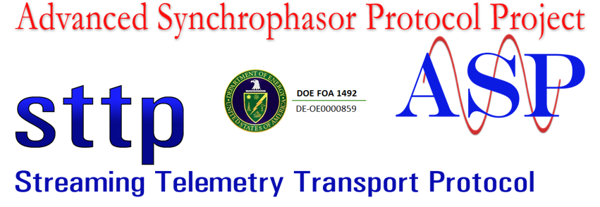
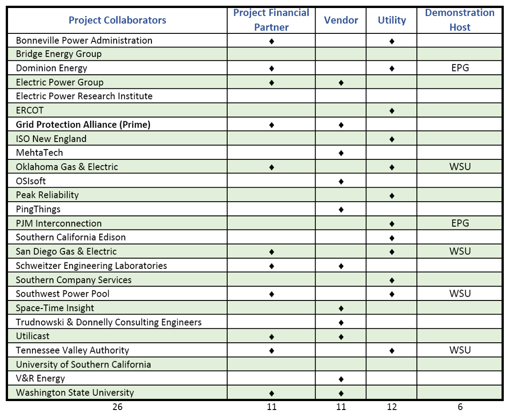

## STTP Specification

**Version:** 0.0.0 - June 19, 2017

**Status:** Preliminary Development

**Abstract:** This specification defines a publish-subscribe data communication protocol that has been optimized for the exchange of real-time and historical streaming data such as synchrophasor data.  It includes a x, y and z as well as guide on use of an API coded in multiple languages as well as a reference on use of API.

**Disclaimer:** This document was prepared as a part of work sponsored by an agency of the United States Government (DE-OE-0000859).  Neither the United States Government nor any agency thereof, nor any of their employees, makes any warranty, express or implied, or assumes any legal liability or responsibility for the accuracy, completeness, or usefulness of any information, apparatus, product, or process disclosed, or represents that its use would not infringe privately owned rights.  Reference herein to any specific commercial product, process, or service by trade name, trademark, manufacturer, or otherwise does not necessarily constitute or imply its endorsement, recommendation, or favoring by the United States Government or any agency thereof.  The views and opinions of authors expressed herein do not necessarily state or reflect those of the United States Government or any agency thereof.

**License:** This specification is free software and it can be redistributed and/or modified under the terms of the [MIT License](LICENSE). This Specification is distributed in the hope that it will be useful, but WITHOUT ANY WARRANTY; without even the implied warranty of MERCHANTABILITY or FITNESS FOR A PARTICULAR PURPOSE.

**Format:** This document is separated into multiple files where each section is its own markdown file in the *Sections* folder. At regular intervals, a complete single document will be published for download.  You can start navigating documentation by clicking the link to the table of contents below, which is the default README of the *Sections* folder:

### [Table of Contents](Sections)

### Other Links

- [Contributing to STTP](CONTRIBUTING.md)
- [STTP Authors](AUTHORS) - as self reported
- [ASP Project Overview](http://www.naspi.org/sites/default/files/2017-03/gpa_robertson_asp_doe_20170322.pdf)
- [Gateway Exchange Protocol (GEP)](http://gridprotectionalliance.org/docs/products/gsf/gep-overview.pdf) - used as a model for STTP
- [GEP Study by Peak RC](https://www.naspi.org/naspi/sites/default/files/2017-03/PRSP_Phasor_Gateway_Whitepaper_Final_with_disclaimer_Final.pdf)
- [Projected Project Timeline](https://raw.githubusercontent.com/sttp/Specification/master/Sections/Images/ASPProjectTimeline.png)

#### Primary Project Participants

