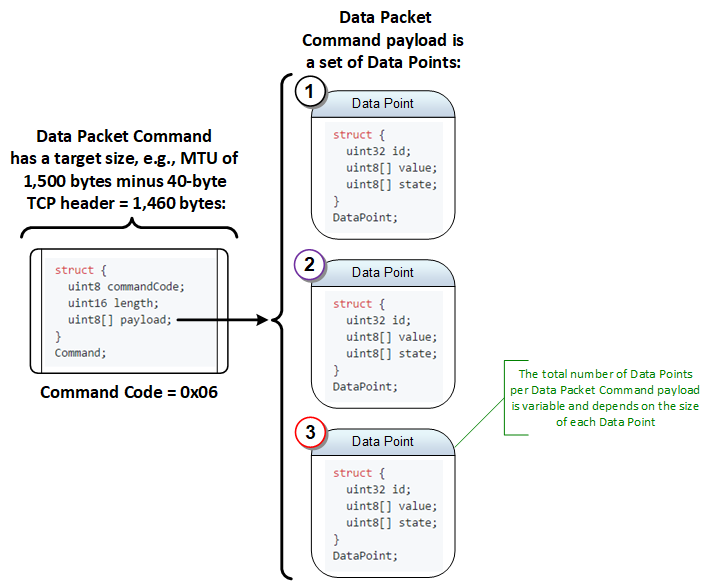

## Data Point Structure

When a subscriber has issued a [subscribe command](Commands.md#subscribe-command) to its publisher for select set of data points, the publisher will start sending [data point packet commands](Commands.md#data-point-packet-commands) each with a payload of several data point values serialized using the `DataPoint` structure, defined as follows:

```C
struct {
  uint32 id;
  uint8[] value;    // Size based on type, up to 64-bytes
  uint8[] state;    // Size based on flags, up to 26-bytes
}
DataPoint;
```

The actual number of `DataPoint` structures contained in the data point packet command depends the configured maximum payload size and the serialized size of the data point structures, see [Figure 6](#user-content-figure6).

<a name="figure6"></a> <center>



<sup>Figure 6</sup>
</center>

> :information_source: The maximum size of a `DataPoint` structure instance is 94-bytes, however, with simple encoding techniques this size can be reduced down to a few bytes for most value types.

### Data Point Value Types

The data types available to a `DataPoint` are described in the `ValueType` enumeration, defined below:

```C
enum {
  Null = 0,     // 0-bytes
  Int64 = 1,    // 0 to 8-bytes
  Single = 2,   // 0 to 4-bytes
  Double = 3,   // 0 to 8-bytes
  String = 4,   // 1MB Limit, however, if the value is too large, additional overhead will occur to send the value out of band.
  Buffer = 5    // 1MB Limit, however, if the value is too large, additional overhead will occur to send the value out of band.
}
ValueType; // sizeof(uint8), 1-byte
```

More complex data types derived from the fundamental type are specified in `DerivedValueType`, along with any needed associated structures.
The enforcement/decoding of these derived types will occur above the wire protocol level and their types will be exchanged as metadata.

```C
enum {
  Null = 0,     // Derives from ValueType.Null, 0-bytes
  SByte = 1,    // Derives from ValueType.Int64, 1-byte
  Int16 = 2,    // Derives from ValueType.Int64, 2-bytes
  Int32 = 3,    // Derives from ValueType.Int64, 4-bytes
  Int64 = 4,    // Derives from ValueType.Int64, 8-bytes
  Byte = 5,     // Derives from ValueType.Int64, 1-byte
  UInt16 = 6,   // Derives from ValueType.Int64, 2-bytes
  UInt32 = 7,   // Derives from ValueType.Int64, 4-bytes
  UInt64 = 8,   // Derives from ValueType.Int64, 8-bytes
  Decimal = 9,  // Derives from ValueType.Buffer, 16-bytes
  Double = 10,  // Derives from ValueType.Double, 8-bytes
  Single = 11,  // Derives from ValueType.Single, 4-bytes
  Ticks = 12,   // Derives from ValueType.Buffer, 8-bytes
  Bool = 13,    // Derives from ValueType.Int64, 1-byte
  Guid = 14,    // Derives from ValueType.Buffer, 16-bytes
  String = 15,  // Derives from ValueType.String, 1MB Limit
  Buffer = 16   // Derives from ValueType.Buffer, 1MB Limit
}
DerivedValueType; // sizeof(uint8), 1-byte
```

> Note: When encoding unsigned values as 64-bit signed values, they must first be converted to a 64-bit unsigned value, 
then converted to a 64-bit signed value. Otherwise leading 1's might be appended to the value. 
Example: A byte value of 255 converted to a sbyte would be -1, then converted to a int64 would maintain it's -1.

- `Null`: No space occupied
- `SByte`: [8-bit Signed Byte](https://en.wikipedia.org/wiki/Byte) (1-byte, big-endian)
- `Int16`: [16-bit Signed Integer](https://en.wikipedia.org/wiki/Integer_%28computer_science%29#Value_and_representation) (2-bytes, big-endian)
- `Int32`: [32-bit Signed Integer](https://en.wikipedia.org/wiki/Integer_%28computer_science%29#Value_and_representation) (4-bytes, big-endian)
- `Int64`: [64-bit Signed Integer](https://en.wikipedia.org/wiki/Integer_%28computer_science%29#Value_and_representation) (8-bytes, big-endian)
- `Byte`: [8-bit Unsigned Byte](https://en.wikipedia.org/wiki/Byte) (1-byte, big-endian)
- `UInt16`: [16-bit Unsigned Integer](https://en.wikipedia.org/wiki/Integer_%28computer_science%29#Value_and_representation) (2-bytes, big-endian)
- `UInt32`: [32-bit Unsigned Integer](https://en.wikipedia.org/wiki/Integer_%28computer_science%29#Value_and_representation) (4-bytes, big-endian)
- `UInt64`: [64-bit Unsigned Integer](https://en.wikipedia.org/wiki/Integer_%28computer_science%29#Value_and_representation) (8-bytes, big-endian)
- `Decimal`: [128-bit Decimal Floating Point](https://en.wikipedia.org/wiki/Decimal128_floating-point_format) (16-bytes, per [IEEE 754-2008](https://en.wikipedia.org/wiki/IEEE_754))
- `Double`: [64-bit Double Precision Floating Point](https://en.wikipedia.org/wiki/Double-precision_floating-point_format) (8-bytes, per [IEEE 754-2008](https://en.wikipedia.org/wiki/IEEE_754))
- `Single`: [32-bit Single Precision Floating Point](https://en.wikipedia.org/wiki/Single-precision_floating-point_format) (4-bytes, per [IEEE 754-2008](https://en.wikipedia.org/wiki/IEEE_754))
- `Bool`: [Boolean as 8-bit Unsigned Integer](https://en.wikipedia.org/wiki/Boolean_data_type) (1-byte, big-endian, zero is `false`, non-zero value is `true`)
- `Guid`: [Globally Unique Identifer](https://en.wikipedia.org/wiki/Universally_unique_identifier) (16-bytes, big-endian for all components)
- `Time`: [Time as `Timestamp`](https://en.wikipedia.org/wiki/System_time) (16-bytes, see [data point timestamp](#data-point-timestamp))
- `String` [Character String as `StringValue`](https://en.wikipedia.org/wiki/String_%28computer_science%29) (Maximum of 64-bytes - 1-byte header with 63-bytes of character data, encoding is UTF8)
- `Buffer` [Untyped Data Buffer as `BufferValue`](https://en.wikipedia.org/wiki/Data_buffer) (Maximum of 64-bytes - 1-byte header with 63-bytes of data)

Both the `String` and `Buffer` represent variable length data types. Each variable length data point will have a fixed maximum number of bytes that can be transmitted per instance of the `DataPoint` structure. For data sets larger then the specified maximum size, data will need to be fragmented, marked with a [sequence number](#data-point-sequence-number) and transmitted in small chunks, i.e., 63-byte segments. For this large data set collation scenario, it is expected that the data packets will be transmitted over a reliable transport protocol, e.g., TCP, otherwise the subscriber should expect the possibility of missing fragments. Details for the content of the `String` type which is the `StringValue` structure and the `Buffer` type which is the `BufferValue` structure are defined as follows:

```C
struct {
  uint8 length;
  uint8[] data; // Maximum size of 63
}
StringValue;

struct {
  uint8 length;
  uint8[] data; // Maximum size of 63
}
BufferValue;
```

> :construction: Some tests need to be run to determine if 64-bytes of variable string / buffer data is an effective use of space and provides optimal performance in data point packets. This target size may need to be an adjustable parameter in initial STTP implementations.

### Data Point Timestamp

The timestamp format for STTP is defined to accommodate foreseeable use cases and requirements for representations of time and elapsed time spans. The following defines the binary format of a `Timestamp` structure which consists of epoch based whole seconds and any fraction of a second. The timestamp fraction also includes a bit for indication of a leap-second in progress.

```C
enum {
  MillisecondMask = 0x0FFC000000000000, // (fraction >> 50) & 1023
  MicrosecondMask = 0x0003FF0000000000, // (fraction >> 40) & 1023
  NanosecondMask  = 0x000000FFC0000000, // (fraction >> 30) & 1023
  PicosecondMask  = 0x000000003FF00000, // (fraction >> 20) & 1023
  FemtosecondMask = 0x00000000000FFC00, // (fraction >> 10) & 1023
  AttosecondMask  = 0x00000000000003FF, // fraction & 1023
  Leapsecond      = 0x1000000000000000, // Set if leap-second is in progress
  ReservedBits    = 0xE000000000000000
}
FractionFlags; // sizeof(uint64), 8-bytes

struct {
  int64 seconds;          // Seconds since 1/1/0001
  FractionFlags fraction; // Fractional seconds
}
Timestamp; // 16-bytes
```

- The `seconds` field defines the whole seconds since 1/1/0001 with a range of 584 billion years, i.e., +/-292 billion years.
- The `fraction` field is an instance of the `FractionFlags` enumeration that defines the fractional seconds for the timestamp with a resolution down to attoseconds. More specifically, the `fraction` field is broken up into 10-bit segments where each segment represents 1,000 units, 0 to 999, of fractional time - similar to a binary coded decimal. There are 10-bits for milliseconds, 10-bits for microseconds, 10-bits for nanoseconds, 10-bits for picoseconds, 10-bits for femtoseconds, and 10-bits for attoseconds. Bit 60 is used to indicate a leap-second is in progress; the remaining 3-bits, 61-63, are reserved.

> :information_source: The size of a `Timestamp` structure instance is 16-bytes, however, simple encoding techniques make it so that unused and repeating sections of time can be compressed out of the data point `state` so that it consumes much less space.

### Data Point Time Quality Flags

Data points can also include a `TimeQualityFlags` structure in the serialized state data, defined below, that describes both the timestamp quality, defined with the `TimeQuality` enumeration value, as well as an indication of if a timestamp was not measured with an accurate time source.

The time quality detail is included for devices that have access to a GPS or UTC time synchronization source, e.g., from an IRIG timecode signal. For timestamps that are acquired without an accurate time source, e.g., using the local system clock, the `TimeQuality` value should be set to `Locked` and the `TimeQualityFlags.NoAccurateTimeSource` should be set.


```C
enum {
  Locked = 0x0,                       // Clock locked, Normal operation
  Failure =  0xF,                     // Clock fault, time not reliable
  Unlocked10Seconds = 0xB,            // Clock unlocked, time within 10^1s
  Unlocked1Second = 0xA,              // Clock unlocked, time within 10^0s
  UnlockedPoint1Seconds = 0x9,        // Clock unlocked, time within 10^-1s
  UnlockedPoint01Seconds = 0x8,       // Clock unlocked, time within 10^-2s
  UnlockedPoint001Seconds = 0x7,      // Clock unlocked, time within 10^-3s
  UnlockedPoint0001Seconds = 0x6,     // Clock unlocked, time within 10^-4s
  UnlockedPoint00001Seconds = 0x5,    // Clock unlocked, time within 10^-5s
  UnlockedPoint000001Seconds = 0x4,   // Clock unlocked, time within 10^-6s
  UnlockedPoint0000001Seconds = 0x3,  // Clock unlocked, time within 10^-7s
  UnlockedPoint00000001Seconds = 0x2, // Clock unlocked, time within 10^-8s
  UnlockedPoint000000001Seconds = 0x1 // Clock unlocked, time within 10^-9s
}
TimeQuality; // 4-bits, 1-nibble

enum {
  None = 0,
  TimeQualityMask = 0xF,        // Mask for TimeQuality  
  NoAccurateTimeSource = 1 << 7 // Accurate time source is unavailable
}
TimeQualityFlags; // sizeof(uint8), 1-byte
```

> :construction: The remaining available bits in the `TimeQualityFlags` enumeration could be made to directly map to IEEE C37.118 leap-second flags. Existing IEEE text could then be used to describe the function of these bits if deemed useful:

```C
LeapsecondPending = 1 << 4,   // Set before a leap second occurs and then cleared after
LeapsecondOccurred = 1 << 5,  // Set in the first second after the leap second occurs and remains set for 24 hours
LeapsecondDirection = 1 << 6, // Clear for add, set for delete
```

### Data Point Data Quality Flags

A set of data quality flags are defined for STTP data point values in the `DataQualityFlags` enumeration, defined as follows:

```C
enum {
  Normal = 0,                 // Defines normal state
  BadTime = 1 << 0,           // Defines bad time state when set
  BadValue = 1 << 1,          // Defines bad value state when set
  UnreasonableValue = 1 << 2, // Defines unreasonable value state when set
  CalculatedValue = 1 << 3,   // Defines calculated value state when set
  MissingValue = 1 << 4,      // Defines missing value when set
  ReservedFlag = 1 << 5,      // Reserved flag
  UserDefinedFlag1 = 1 << 6,  // User defined flag 1
  UserDefinedFlag2 = 1 << 7   // User defined flag 2
 }
DataQualityFlags; // sizeof(uint8), 1-byte
```

> :information_source: These quality flags are intentionally simple to accommodate a very wide set of use cases and still provide some indication of data point value quality. More complex data qualities can exist as new data points.

### Data Point Sequence Identifier

For large buffers or strings being sent that span multiple data points, a new session based identifier needs to be established that represents the sequence. This is needed since different values for the same `DataPointKey.uniqueID` could overlap during interleave processing.

For data that needs to be transmitted with a defined sequence identifier, the `DataPoint.flags` must include the `StateFlags.Sequence` flag.

### Data Point Fragment Number

For large buffers or strings being sent that span multiple data points, a fragment number defines the buffer index of a given sequence that can be used reassemble the sequence.

For data that needs to be transmitted with a defined fragment number, the `DataPoint.flags` must include the `StateFlags.Fragment` flag.
