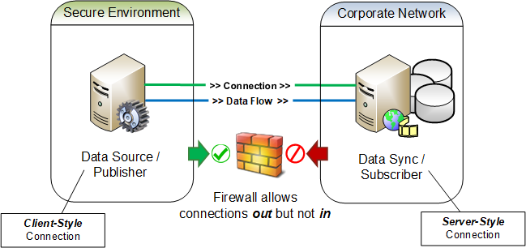

  [8069efb5]: https://en.wikipedia.org/wiki/Transport_Layer_Security "TLS"
  [c464180d]: https://en.wikipedia.org/wiki/X.509 "x509"
  [df75d7bc]: https://en.wikipedia.org/wiki/Certificate_authority "CA"

## Establishing Connections

For normal STTP connections that are established using IP sockets, the actual details of establishing a socket connection are specific to the operating system used as well as the specific programming language used. However, major implementations share much in common as to let us talk in generic terms here.  The minimum information needed to create a socket is (1) an endpoint, i.e., the IP address and port number, (2) the desired IP transport protocol, e.g., TCP or UDP, and (3) the type connection to be established, i.e., a _server-style_ socket or a _client-style_ socket. A server-style socket is one that listens for connections from clients. A client-style socket is one that connects to a listening server socket. Client-style sockets are always the _initiators_ of any given connection, i.e., client sockets always "make the call" to server sockets to begin communications.

### Forward Connections

As noted in the overview, there are times that we want the data sender in STTP to be the initiator of the socket connection for security reasons.  Under typical conditions STTP publishers, the data provider will set up a server-style listening sockets, and STTP subscribers, as data consumers, will use client-style sockets to initiate connections to a publisher's listening socket. Establishing a server-style socket for a publisher and client-style sockets for any subscribers describes a connectivity model for STTP that is called a _forward connection_. Forward connections are expected to be the normal use case for STTP publisher/subscriber connections. However, for an STTP connection it does not matter which party, publisher or subscriber, is the initiator of the socket connection.

### Reverse Connections

In STTP it is perfectly valid for a publisher to initiate a client-style socket connection to a subscriber that is listening with an established server-style socket. This type of connectivity model is called a _reverse connection_. Since a client-style connection is the only type of socket that can initiate a connection, a reverse connection requires the publisher to be the initiator of a connection such that the target subscriber would be able to receive data.

Reverse connections flip the normal responsibilities of a publish/subscribe messaging pattern by having parties that provision the data also the be the initiators of a connection. Data subscribers, which might otherwise come and go as needed, now become a persistent network resource that needs to be readily available for a connection from its publisher. Reverse connections can require more data flow planning and network engineering to ensure that connections are initiated from the proper locations while having the data reliably flow to the desired locations.   Most often a _reverse connection_ is used to ensure connection is initiated from a environment of higher security to one of a lower security as is cyber security and NERC CIP best practice.

Regardless of how a connection is established, forward or reverse, the functions, roles and responsibilities of the participants will not change, i.e., a publisher shall still be the provider of data and the subscriber shall still be the consumer of data. Additionally, any required protocol negotiations by the parties continues as normal once the connection has been established.

> :information_source: Increased flexibility in the connectivity models for STTP is necessary so that security boundaries that have been enforced with firewall rules can be maintained. A common use case is that the publisher, and the data it is has access to, will exist in a secure network environment and the subscribers, which need access to the data, will exist in less secure network environments. In these scenarios, firewall rules will prohibit any connections to be initiated from an environment that is considered to be less secure. However, such environments normally allow connections to be initiated from inside the secure environment out to listening connections in less secure environments, see [Figure 4](#user-content-figure4). Described more simply, nothing can reach in to systems in the secure environment, but systems in the secure environment can reach out - this is much like how a computer in a home network can access the public Internet through a router, but the router's built-in firewall prevents systems on the Internet from accessing the home computer. Although reverse connections may initially seem counter-intuitive, they exist as a firm STTP requirement to allow for successful data exchange from within secure environments.

 

Figure 4

### Bidirectional Data Exchange

For simple TCP only based connectivity configurations, once a connection has been established between two systems a communications pathway exists such that data can flow bidirectional. This is true regardless of which party uses a client or server socket or the connectivity model in use, i.e., a forward or reverse connection.

Since data in a TCP based connection can easily move in both directions, both parties can simultaneously enable both publisher and subscriber functions. This allows STTP to be used in a data exchange _gateway_ capacity allowing for bidirectional data exchange with simplified connectivity requirements. The only decision two parties would need to make in this mode of operation is which STTP instance acts as a server and which instance acts as a client.

More traditional configuration models can be established for bidirectional data exchange as well, such as, restricting server-style sockets to publisher functions with connecting client-style sockets restricted to subscriber functions. In this configuration, both parties would have listening server-style sockets for publisher functions and both would need to establish client-style sockets for subscriber functions. This may be the preferred mode of operation when one or more parties want to have more control over subscriber connectivity and security, or desire to use UDP for data transmission.

### Using UDP for Data Transmission

By reducing the STTP capability set to functions that support lossy data transmission, data channel functionality in STTP can be established over a UDP connection. When using a UDP based data channel, command channel functionality is expected be established over a TCP connection. A reliable command channel is needed in order to properly manage initial protocol negotiations, which includes establishing the operational modes of the publisher/subscriber connection, and provides the ability for subscribers to choose the data to be received.

STTP data channel functionality is designed to be sent without the expectation of a response in order to accommodate connections that have unidirectional data flows, such as UDP. Any functionality related to transmitted data that requires a response, e.g., a delivery receipt, must be managed by the command channel.

> :wrench: The initial subscriber command request sent to a publisher should include the UDP port that the subscriber wishes the publisher to use, see [operational modes negotiation](Commands.md#operational-modes-negotiation). The destination UDP port is a local resource for the subscriber host machine and therefore under its control. However, UDP endpoints often need specific firewall rules to allow data transmission, thus requiring a preselected port to be established during the initial configuration process.

It is expected that STTP will normally be used over Internet Protocol. In order to meet the entire set of capabilities as enumerated in this specification, a TCP/IP based connection shall be required for at least the _command channel_. A single TCP connection can be used to meet the requirements for both the _command channel_ and _data channel_ functions giving the full capability for both basic and advanced STTP functions. Alternatively a connections could use UDP/IP on a separate socket for _data channel_. Using UDP connections for  _data channel_ does reduce the set of capabilities that can be supported. As an example, since UDP is a **lossy** transmission protocol, so any capabilities that implement stateful connection such as advanced compression or function that require delivery guarantees cannot be supported using UDP _data channel_.

> :information_source: UDP only style deliveries, either unicast or multicast, of data using STTP can only be accommodated with substantial capability restrictions. That is, with no reliable command channel, consumers of STTP data provided over a UDP only connection would be subject to publisher established formats, content and resolution of the data being delivered. Alternately, establishment of a UDP based command channel would require adjustments in protocol behavior to accommodate failures to send command requests and/or receive responses due to lack of delivery guarantees.  While it is expected that with the right set of initial assumptions and capability restrictions that STTP could effectively operate with a UDP only connection, the main text of this specification will intentionally remain silent on such details for the sake of simplicity, clarity and brevity.

> :construction: Add an appendix to discuss how a UDP only STTP transmission should work so that needed caveats and capability restrictions can be established for this behavior. Describing this operation is important given that UDP only data transmissions for synchrophasors is widely used in production environments today. UDP only deployments, e.g., multicast, can also be very useful in lab environments for simplicity in data distribution. Regardless of the veracity and logic for the technical arguments that can be made to not use UDP, either by itself or in combination with TCP, by not defining the protocol behavior in these modes of operation there is increased risk of the protocol not being initially adopted or accepted. Having these behaviors documented will help alleviate any non-standard implementations that may crop up otherwise. Reference implementations will be adjusted to accommodate these use-cases as time allows, however UDP options will be implemented at lower priority. During code development, UDP use cases will be kept in-mind such that future iterations of the reference implementations can accommodate UDP based behaviors and functionality more readily.

### Secure Connections

For data transmissions over the Internet or those that need to transmit sensitive data, a secured socket connection should be established for STTP communications. To secure a connection, a socket must be established with standard [Transport Layer Security][8069efb5] (TLS) using a signed X.509 certificate. TLS is used to encrypt, authenticate and attest to the integrity of the data being transmitted over STTP.

> :wrench: As of the writing of this specification, the latest available TLS version is 1.2, with the 1.3 version still in draft. The default stance for STTP implementations is to always default to the latest, hence most secure, version of TLS available. However, since different operating systems and programming languages may not be up-to-date with the latest TLS versions and different implementations of STTP need to be interoperable, the TLS version to use for any publisher/subscriber connection should be configurable. However, STTP implementations should log a warning if a connection is established using a version of TLS that is less than the latest supported version for the implementation.

TLS is a protocol layer that sits above TCP, as a result, secure connections are established in exactly the same manner as basic TCP connections, however once the socket is connected, TLS adds the needed negotiations to enable security. Just like with a socket, the actual details of establishing a secure TLS session are specific to an operating system and ultimately the programming language being used.

#### Certificate Validation

The use of [X.509][c464180d] certificates are required in order to secure an STTP connection using TLS. For STTP, certificates are used to verify the identity of a connection, as well as to provide data encryption and integrity guarantees. For confidence in the certificates being used, STTP defines the operations needed to ensure that certificates are valid.

STTP implementations have the capability to use either self-signed certificates or those signed by a [certificate authority][df75d7bc] (CA). For CA issued certificates, trust is delegated to the CA, which normally means the CA needs to be accessible during the validation process.

For self-signed certificates, trust exists between the two parties exchanging certificates, which means each party needs to agree to keep the certificates private and to notify the other party if the host machine is ever known to be compromised, i.e., where an external party may have been able to gain access to the private keys stored for the certificate. Since trust for self-signed certificates is between the two parties exchanging data, STTP requires that the certificates be exchanged in advance - a self-signed cert sent during TLS negotiations must be considered untrusted. Self-signed certificates should always be exchanged out-of-band, i.e., not over the STTP protocol, and should never include the private keys.

Certificate validation is handled in terms of the type of socket connection that is established, i.e., a client-style socket or a server style-socket. The STTP functional role of the party, i.e., publisher or subscriber, does not affect the certificate validation process because both client and server style connections can be setup to validate certificates. Consequently a publisher can validate subscriber certificates and a subscriber can validate its publisher certificate regardless of which connectivity model in use, forward or reverse.

> :wrench: Through configuration, STTP implementations should be able to gracefully accommodate use cases where the certificate validation steps encounter errors, e.g., self-signed certificates returning an expected untrusted root error or a common name mismatch error [[18](References.md#user-content-ref18)]. This is important since STTP can be deployed in environments where there is no public Internet access or where a client connection may appear to have a mismatched IP addresses due to a difference caused by NAT configuration. Certificate error conditions such as the inability to verify hostnames, IP addresses or contact an issuing CA should be mitigatable through configuration of the STTP implementation. For user interfaces, appropriate warnings and feedback should be provided as to the possible impact on security when errors are suppressed. Any new configurations should always default to the highest level of security and error warnings but be easily adjustable for any given environment as deemed appropriate by a user.

##### Client Certificate Validation

For server certificates issued by a CA that need validation, STTP implementations supports traditional client-style connections with TLS similar to how a browser connects to a secure site with HTTPS and validates the site's certificate. In this mode, when an STTP client-style socket connects to a server-style socket that has a CA issued certificate, with the certificate being provided by the server as part of the data in the TLS negotiation process, the client shall validate the server's certificate by (1) verifying the certificate's signature, (2) ensuring the certificate has not been revoked by checking the certificate revocation lists, and (3) checking that the information in the certificate information is valid, i.e., validating that one of the hostnames or IP addresses listed in the certificate subject field match the connection information for the server.

Validation of self-signed server certificates are similar to those for CA signed certificates but does not include steps that engage a CA. In this mode, when an STTP client-style socket connects to a server-style socket that has a self-signed certificate, the client shall validate the server's certificate by (1) verifying the certificate's signature, and (2) checking that the information in the certificate is valid, i.e., validating that one of the hostnames or IP addresses listed in the certificate subject field match the connection information for the server.

##### Server Certificate Validation

STTP implementations also support server-style connections with TLS, with the ability to validate client certificates issued by a CA. In this mode, when an STTP server-style socket accepts a connection from a client-style socket that has a CA issued certificate, with the certificate being provided by the client as part of the data in the TLS negotiation process, the server shall validate the client's certificate by (1) verifying the certificate's signature, (2) ensuring the certificate has not been revoked by checking the certificate revocation lists, and (3) checking that the information in the certificate information is valid, i.e., validating that one of the hostnames or IP addresses listed in the certificate subject field match the connection information for the client.

Validation of self-signed client certificates are similar to those for CA signed certificates but does not include steps that engage a CA. In this mode, when an STTP server-style socket accepts a connection from a client-style socket that has a self-signed certificate, the server shall validate the client's certificate by (1) verifying the certificate's signature, and (2) checking that the information in the certificate is valid, i.e., validating that one of the hostnames or IP addresses listed in the certificate subject field match the connection information for the client.

> :warning: For CA issued certificate validations, the listed step that requires STTP to "validate that a certificate has not been revoked by checking the certificate revocation lists", is feature that is commonly handled by libraries that implement TLS. This step is iterated here as a requirement in case an STTP implementation uses a TLS library that does not automatically handle this feature.

#### UDP Security with Secure Connections

When a UDP data channel is in use and needs to be secured, it is expected to be associated with a command channel that is secured using TLS. With communications for the command channel already secured, it is safe to exchange encryption keys that can be used to secure the UDP traffic.

STTP secures UDP traffic using the AES encryption algorithm and a 256-bit publisher generated symmetric encryption key and initialization vector that shall be provided to the subscriber over the TLS secured command channel, see [secure data channel command](Commands.md#secure-data-channel-command).

> :information_source: Although TLS is normally used with reliable IP transport protocols such as TCP, TLS has also been implemented for UDP using the Datagram Transport Layer Security (DTLS) protocol. This protocol could allow a UDP channel to be secured without having a preexisting TLS secured command channel and even provide security for UDP only style data deliveries. However, as of the writing of this specification, DTLS implementations were not widely available on the platforms and programming languages that were being targeted for initial STTP reference implementations.
