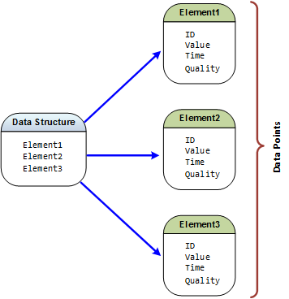
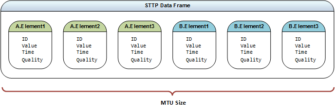

## Protocol Overview

In typical messaging exchange paradigms a source application hosts a block of structured data, composed in memory, with the intent to transmit the data to one or more receiving applications. The data has _structure_ in the sense that it exists as a collection of simpler primitive data types where each of the data elements is given a name to provide useful context and meaning; most programming languages represent data structures using a primary key word, e.g., `class` or `struct`. Before transmission, the data structure must be serialized - this is necessary because the programming language of the source application which hosts the data structure defines the structure in memory using a format that is optimized for use in the application. The process of serializing the data structure causes each of the data elements to be translated into a format that is easily transmitted over a network and is suitable for deserialization by a receiving application.

The applications that are sending and receiving data structures can be running on the same machine or on different physical hardware with disparate operating systems. As a result, the details of the data structure serialization format can be complex and diverse. Such complexities can include issues with proper handling of the endianess of the primitive data types during serialization which may differ from the system that is deserializing the data, or differences in the interpretation of how character data is encoded <sup>[[6](References.md#user-content-ref6)]</sup>.

The subject of serializing data structures in the field of computer science has become very mature; many solutions exist to manage the complexities of serialization. Today most computer programming languages, or their associated frameworks, include various options for serializing data structures in multiple formats. However, these solutions tend to only work within their target ecosystems and are usually not very interoperable with other frameworks or languages.

When interoperability is important, other technologies exist that focus on data structure serialization that works regardless of hardware, operating system or programming language. Two of these serialization technologies that are in wide use are Google Protocol Buffers <sup>[[7](References.md#user-content-ref7)]</sup> and the Facebook developed Apache Thrift <sup>[[8](References.md#user-content-ref8)]</sup>. Both of these serialization frameworks create highly compact, cross-platform serializations of data structures with APIs that exist in many commonly used programming languages.

For smaller sized, discrete data structures, the existing available serialization technologies are very fast and highly effective. However, as the data structures become larger, the process of serialization and deserialization becomes more costly in terms of both memory allocation and computational processing. Because of this, large frames of data are not recommended for use by these serialization technologies <sup>[[9](References.md#user-content-ref9)]</sup> <sup>[[10](References.md#user-content-ref10)]</sup>. Additionally, and perhaps more importantly, there are also penalties that occur at the network transport layer.

> :information_source: For the purposes of this specification, serialized data structures will be referred to as a _frames_, regardless of the actual binary format.

##### Data Structure Serialization in the Power Industry

In the electric power industry, the IEEE C37.118 <sup>[[1](References.md#user-content-ref1)]</sup> protocol exists as a standard serialization format for the exchange of synchrophasor data. Synchrophasor data is typically measured with an accurate time source, e.g., a GPS clock, and transmitted at high-speed data rates, up to 120 frames per second. Measured data sent by this protocol is still simply a frame of serialized primitive types which includes data elements such as a timestamp, status flags, phasor angle / magnitude pairs, etc. The IEEE C37.118 protocol also prescribes the combination of data frames received from multiple source devices for the same timestamp into one large combined frame in a process known as concentration. The concentration process demands that a waiting period be established to make sure all the expected data frames for a given timestamp arrive. If any frames of data do not arrive before the waiting period expires, the overall combined frame is published anyway. Since the frame format is fixed, empty data elements that have no defined value, e.g., NaN or null, still occupy space for the missing frames.

<p class="insert-page-break-after"></p>

### Large Frame Network Impact

In terms of Internet Protocol (IP), all frames of data to be transmitted that exceed the negotiated maximum transmission unit (MTU) size (typically 1,500 bytes for Ethernet networks <sup>[[11](References.md#user-content-ref11)]</sup>) are divided into multiple fragments where each fragment is called a network packet, see [Figure 1](#user-content-figure1).

<a name="figure1"></a> <center>


<sup>Figure 1</sup>
</center>

The impacts of large frames on an IP network are determined by the number of network packets required to send the frame and the fact that IP is inherently unreliable by design. Network packets can only be transmitted over a connection one packet at a time; when two or more network packets arrive for transmission at the same time on any physical network media, the result is a collision. When a collision occurs, only one packet gets sent and the others get dropped <sup>[[12](References.md#user-content-ref12)]</sup>. IP defines a variety of different transport protocols for network packet transmission, each of which behave in different manners when dealing with packet loss. Consequently, many of the impacts a large frame has on an IP network is dependent upon the transport protocol used to send the frame.

> :tomato::question: KEM: _Can you have a collision on a full duplex system? If so, it sounds like buffering is improperly implemented._

> :bulb: JRC: _A full duplex system prevents network media collisions between incoming and outgoing traffic. It does not prevent UDP data loss from buffer overruns in the OS network stack nor does it prevent collisions from simultaneous traffic._

#### Large Frame Impacts on TCP/IP

The most common Internet protocol, TCP/IP, creates an index for each of the network packets being sent for a frame of data and verifies that each are successfully delivered, retransmitting packets as many times as needed in the case of loss. This functionality is the basis for TCP being considered a _reliable_ data transmission protocol.

Since each packet of data for the transmitted frame is sequentially ordered, TCP is able to fully reconstruct and deliver the original frame once all the packets have arrived. However, for very large frames of data this causes TCP to suffer from the same kinds of impacts on memory allocation and computational burden as the aforementioned serialization technologies, i.e., Protocol Buffers and Thrift. The unique distinction for IP based protocols is that at some level, these issues also affect every element of the interconnected network infrastructure between the source and sync of the data being exchanged.

Another critical impact that is unique to TCP is that for data that needs to be delivered in a timely fashion, retransmissions of dropped packets can also cause cumulative time delays <sup>[[13](References.md#user-content-ref13)]</sup>, especially as large data frames are published at rapid rates. Time delays are also exacerbated during periods of increased network activity which induces congestion and a higher rate of collisions.

> :information_source: Synchrophasor data is the source for real-time visualization and analysis tools which are used to operate the bulk electric system (BES). This real-time data is required to be accurate, dependable and timely in order to be useful for grid operators <sup>[[14](References.md#user-content-ref14)]</sup>. Any delays in the delivery of this data could have adverse affects on operational decisions impacting the BES.

<p class="insert-page-break-after"></p>

#### Large Frame Impacts on UDP/IP

Another common Internet protocol is UDP/IP. Transmission of data over UDP differs from TCP in the fact that UDP does not attempt to retransmit data nor does it make any attempts to maintain the order of the transmitted packets. This functionality is the basis for UDP being considered a _lossy_ data transmission protocol, but more lightweight than TCP.

Even with the unreliable delivery caveats, UDP will still attempt to reconstruct and deliver the originally transmitted frame of data. However, even if a single network packet is dropped, the entire original frame will be lost and any packets that were already accumulated get discarded <sup>[[15](References.md#user-content-ref15)]</sup>. In other words, there are no partial frame deliveries - frame reception with UDP is an all or nothing operation.

Since UDP attempts frame reconstruction with the received packets, the impact of large frames of data with UDP are similar to those with TCP and serialization technologies in that there is increased memory allocation and computational processing throughout the network infrastructure.

The more problematic impact with UDP and large frames of data is that the increased number of network packets needed to send a large frame also increases the probability of dropping one of those packets due to a collision. Since the loss of any one packet results in the loss of the entire frame of data, as frame size increases, so does volume of overall data loss.

##### Impacts of UDP Loss on Synchrophasor Data

For synchrophasor data, UDP is often the protocol of choice. The density of synchrophasor data allows analytical applications to tolerate _some_ loss. The amount of loss that can be tolerated depends on the nature of the analytic because as the loss increases, the confidence in the analytic results decreases <sup>[[citation needed](References.md)]</sup>. Another reason UDP is used for synchrophasor data is its lightweight nature; use of UDP reduces overall network bandwidth requirements as compared to TCP <sup>[[16](References.md#user-content-ref16)]</sup>. Perhaps the most critical reason for use of UDP for synchrophasor data is that UDP does not suffer from issues with induced time delays caused by retransmission of dropped network packets.

For IEEE C37.118 <sup>[[1](References.md#user-content-ref1)]</sup> deployments, large frame sizes can have adverse affects on data completeness; as more and more devices are concentrated into a single frame of data, the larger frame sizes contribute to higher overall data losses. In tests conducted by PeakRC, measured overall data loss for the transmission of all of its synchrophasor data using IEEE C37.118 averaged over 2% <sup>[[5](References.md#user-content-ref5)]</sup> when using a data rate of 30 frames per second and more than 3,100 data values per frame. To help mitigate the data losses when using UDP, some companies have resorted to purpose-built, dedicated synchrophasor networks <sup>[[17](References.md#user-content-ref17)]</sup>. Although a dedicated network is ideal at reducing data loss (minimizing simultaneous network traffic results in fewer collisions), this will not be an option for most companies that treat the network as a shared resource.

### Changing the Paradigm with STTP

Existing serialization technologies are not designed for messaging exchange use cases that demand sending large frames of data at high speeds, often falling short in terms of timely delivery or data loss depending on the IP transport protocol used. The obvious solution is to break large data structures into smaller ones, recombining them as needed in receiving applications <sup>[[9](References.md#user-content-ref9)]</sup>. Although this strategy can work fine for one-off solutions where data structures are manually partitioned into smaller units for transport, this does not lend itself to an abstract, versatile long term solution.

Instead of serializing an entire data structure as a unit, STTP is designed to package each of the distinct elements of the data structure into small groups. Serialization is managed for each data element, typically a primitive type, that gets individually identified along with any associated state, e.g., time and/or quality information, see [Figure 2](#user-content-figure2). Ultimately more information is being sent, but it is being packaged differently.

> :information_source: For the purposes of this specification a data element, its identification and any associated state, e.g., time and quality, will be referred to as a _data point_.  

<a name="figure2"></a> <center>

**Mapping Data Structure Elements to Data Points**



<sup>Figure 2</sup>
</center>

To resolve issues with large frame impacts on IP based networks, a primary tenet of the STTP design strategy is to reduce fragmentation; as a result, STTP intentionally limits the number of data points that will be grouped together to form a frame to ensure its size is optimized for transmission over an IP network with minimal fragmentation.

Because each data point is uniquely identified, the elements that appear from one frame to another are not fixed allowing interleaving of data from multiple simultaneous data exchanges - this notion supports the delivery of any number of data structures where each can have a different publication interval, see [Figure 3](#user-content-figure3).

<a name="figure3"></a> <center>



<sup>Figure 3</sup>
</center>

> :wrench: While it is possible to always target zero fragmentation by making sure the frame size is below the current MTU size, STTP implementations should allow tuning for some fragmentation to accommodate different deployment scenarios and use cases, i.e., allowing target frame sizes that are larger than the current MTU size. For deployments in high-performance network environments, overall loss due to data collisions may be statistically the same for frame sizes that are a few multiples of the MTU.

#### STTP Bandwidth Impact

Since data points include identity and state along with the primitive type value, serializations of STTP data carry extra information; so by its very nature uncompressed STTP will often require more bandwidth as compared to traditional data structure serialization technologies.

Although it will be common for use cases that demand a protocol like STTP, e.g., transmission of large data sets with variable availability at high speeds, to be deployed in environments that are not bandwidth constrained - simple testing has shown that deviation based compression techniques that have negligible processing impact can yield overall bandwidth requirements for STTP that are equal to or less than other serialization technologies, even when carrying extra information. For synchrophasor data, tests have shown data point serializations to have less than half the bandwidth requirements of IEEE C37.118 <sup>[[1](References.md#user-content-ref1)]</sup> when used over TCP with simple stateful methods for lossless compression <sup>[[5](References.md#user-content-ref5)]</sup>.

Bandwidth requirements for STTP can often be further lowered by reducing the amount of data being transmitted. For most data structure serialization technologies and protocols, the very process of packaging and sending data in the form of data structures means that some data ends up being transmitted that is not used nor needed by receiving applications. Data reduction for these technologies means creating smaller data structures where it can be costly to maintain separate configuration models for multiple data structures just to achieve bandwidth improvements. Since STTP is designed as a publish / subscribe technology, a receiving application can choose to subscribe to only the individual data points it needs.

#### Data Point Level Publish / Subscribe

STTP intrinsically manages data at its most fundamental level, primitive types. Each uniquely identified primitive type value represents some form of physical measurement. When measured with periodicity and associated with a timestamp at the moment of measurement, the resulting sequence of measured values and associated timestamps are known as _time series_ data. Since data points that are serialized by STTP can include time as part the state information for a value, STTP can be considered a time series data transmission protocol. However, the state information for values being transmitted is flexible - what is _time_ for one data point could simply be a _sequence_ for another. Additionally, the existence of some data points can be temporal, for example, to exchange a set of binary data, a temporary data point ID may be created that only exists until the binary data transfer is complete.

STTP uses a publish / subscribe based model for control of the data to be exchanged. This exchange is managed at the data point level where data sourced at a sending application, i.e., the _publisher_, will make a set of data points available for publication. A receiving application, i.e., the _subscriber_, will select a subset of the available points for subscription. As new data is made available at the publisher, the subset of the data as selected by the subscriber will be transmitted.

##### Data Point Metadata

A critical part of the publish / subscribe process is defining the data points that are available for subscription. An STTP publisher will define a tabular list of available data point identifiers and associated descriptive information as the _metadata_ that is available to a subscriber.

Each data point includes a unique identifier; regardless of the binary transmission format, this identifier will exist as a statistically unique GUID in the defined metadata for the available data points. This makes the metadata from multiple publishers easier to merge into local repositories used by a subscriber.

At a minimum, each row in the STTP publisher metadata will include the GUID based data point identifier, a short human readable alpha-numeric _tag_, the primitive data type used for the value of the data point, a description, the enabled state and timestamps for the creation, last update and deletion of the data point.

Metadata in STTP is designed to be extensible. Different industries may require different kinds of available metadata in order to properly map and integrate with other protocols and environments. To accommodate the extensibility, other tabular datasets can be made available by a publisher as needed.

##### Data Point Access Control

STTP puts publishers in full control of access to data. A publisher can choose not to allow connections and/or expose any data to a subscriber that is not strongly identified. Publishers can choose to restrict data access at an individual data point level, a group level or at an identified subscriber level.

Selection of available points for an identified subscriber or a group can be controlled by an expression. Expression based access control means that the even as the data sources available to a publisher change, the expressions will still apply and need not be updated. For example, metadata will need to contain information about the primitive data type for a given data point - an expression based on this data type may look like the following:
```
ALLOW WHERE DataType='BOOL'
```
For this expression, all data points as defined in the metadata that have a data type of `BOOL` would be allowed for the group or identified subscriber. This expression would cause the allowed metadata to dynamically change as the available source data configured in the publisher changed.

#### Data Transport Channels

STTP data transport requires the use of a command channel using TCP/IP for reliable delivery of important commands. Optionally a secondary data channel can be established using UDP/IP for the transport of data that can tolerate loss. When no secondary UDP/IP is used, both commands and data will share use of the TCP/IP channel for communications.

Although not precluded from use over other data transports, the design of STTP is targeted and optimized for use over IP, specifically TCP/IP and UDP/IP. Even so, since the command/response implementation and data packet distribution of the STTP protocol is fairly simple, it is expected that commonly available middleware data transport layers, such as ZeroMQ or DDS, could easily support and transmit data using the STTP protocol should any of the messaging distribution and management benefits of these transport layers be useful to a particular deployment environment. However, these types of deployments are outside the scope of this documentation. If needed, STTP integrations with middleware layers should be added as reference implementation repositories to the STTP organizational site <sup>[[4](References.md#user-content-ref4)]</sup>.

> :tomato::question: JRC: _The question has been raised if a UDP only transport should be allowed? In this mode, any critical commands and responses would basically be sent over UDP. Thought would need to be given to commands and/or responses that never arrive and the consequences thereof._

> :tomato::question: SEC: _We may also consider a UDP method that is not bi-directional. Much like how C37.118 currently supports such a data stream. This could be encrypted by storing the client's public key on the server and encrypting the cipher key periodically. It could be used when transporting from secure environment to an unsecure one. Anytime TCP is used, the potential of buffering and creating a DOS attack on the more secure system is possible. And UDP replies through a firewall are really easy to spoof._

> :confused: JRC: _Presume that this would require an out-of-band pre-defined configuration to be "known" or handle it the way C37.118 currently manages this, i.e., sending a "config frame" once per minute. In context of STTP, this might be a reduced set of metadata that represented "what" was being published. This would need some "rules" to operate properly._

> :bulb: KEM: _The advantage in this case is that UDP will operate unidirectionally, TCP won't. However for commands you really need to close the loop. I suggest that STTP only be developed for TCP as suggested above, but do not state that it cannot be adapted to UDP._

### STTP Feature Summary

* Perform at high volume / large scale
* Minimize data losses (e.g., over UDP)
* Lower bandwidth requirements (e.g., over TCP)
* Optimized for the performant delivery of individual data points
* Automated exchange of metadata (no centralized registry required)
* Detect and expose communication issues
* Security and availability features that enable use on critical systems to support critical operations
* Publish/subscribe at data point level
* API implemented in multiple languages on multiple platforms
* Metadata will be versioned and tabular in nature
* Sets of metadata from multiple parties will be easy to merge
* Points defined in metadata will have a clear ownership path
* A minimal set of metadata will exist to support any STTP deployments
* Industry specific metadata extensions will exist to support specific industry deployments
* Ability to support broadcast messaging and distribution of critical system alarms
